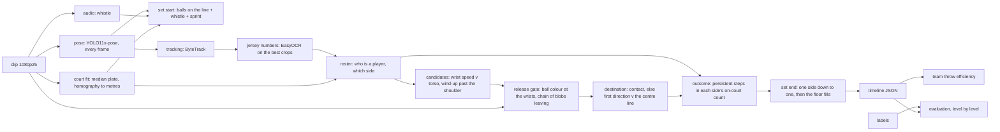

# Dodgeball Throw-Attempt Detection

Broadcast dodgeball footage in; an attributed timeline of throw attempts
(wind-up → release → pass or throw → outcome) and a team throw-efficiency
metric out. One fixed-camera clip of the WDBF 2014 men's final (3.5 min,
one complete set, 60 labelled events) is the evaluation set.

Headline, at ±0.25 s: throwing motions are found at **F1 88%** (P 84%, R 93%);
of the matched motions the **release** (did the ball leave the hand) is right
**88%** of the time, the **kind** (fake / pass / throw) **86%**, and the
**outcome** (hit / catch / miss) **59%**. Team throw efficiency reads **29%**
near v 27% truth and **8%** far v 14% truth. Every number below has a named
failure behind it; the cascade, the labels and the error budget are all built
so that the failures can be read rather than averaged away.

## The event

A **throw attempt** is a player propelling a ball toward the opposing side
with a throwing motion. The rules recognise nothing before release (WDBF
2024, 15.2), so the event is defined as a cascade, each level a separate
decision with its own failure mode and its own score:

```
candidate  — a throwing motion by a player in play (with or without a ball)
├── fake   — no release
├── pass   — released, ball stays on the thrower's side
└── throw  — released, ball crosses to the opposing side
    └── outcome: hit | catch | block | miss
```

The full rule the annotator applied — start, release and end frames, actor,
target, ambiguous cases — is in the plan's
[event definition](docs/plans/throw-attempt-detection.md#event-definition-fixed-2026-08-26-after-the-clip-was-labelled),
grounded in the ruleset quoted in [docs/reference/wdbf-rules.md](docs/reference/wdbf-rules.md).
Two consequences of taking the rules literally: a fake is classified by what
the ball did, not by intent, and a pass is a throw that did not cross (16.2).

**Derived metric — team throw efficiency** = eliminations ÷ throws, per
team per set. It is dodgeball's shooting percentage. Passes and fakes are
outside the denominator, so every pass misread as a throw understates it
and every fake read as a throw dilutes it: the metric's error budget is the
cascade's, level by level.

## Pipeline



The design — pipeline, signal strategy, models and methods, data and labels,
evaluation, compute and latency, failure modes — is
**[docs/design.pdf](docs/design.pdf)** (source `docs/design.tex`, `make design`).
What each stage does and why it was built that way is in
[docs/architecture/](docs/architecture/README.md). The decisions that
shaped the result:

- **The body cannot tell a fake from a throw; the ball can.** Every pose
  feature tried (wrist extension, elbow angle, follow-through, speed decay)
  sits at AUC 0.3–0.7 on fakes v throws — a fake is the same motion with the
  ball kept. The release gate looks for the ball as colour at the wrists,
  then for a chain of ball-sized blobs seen *leaving*. Never "the ball went
  dark": occlusion and a second ball both do that.
  → [release-gate.md](docs/architecture/release-gate.md)
- **Pass v throw from where the ball went, not where it was aimed.**
  Contact with a player decides where the chain reaches one; otherwise the
  first three links' direction against the centre line.
  → [destination.md](docs/architecture/destination.md)
- **Outcome from the game, not the ball.** The frame of contact is
  unobservable at 25 fps and 20 px of ball (a dodge and a hit both end the
  chain in the target's box), and the whistle sounds for fakes too. What is
  observable is that someone leaves: a persistent step in a side's on-court
  count is a hit (or a catch, if the other side gains one), attributed to
  the last throw at that side.
  → [outcome.md](docs/architecture/outcome.md)
- **Identity is a roster, not a track id.** ByteTrack fragments are joined
  by jersey number and side; role comes from being in play during the set's
  core, because a referee's stripes and USA's black print read alike.
  → [roster.md](docs/architecture/roster.md), [player-identity.md](docs/architecture/player-identity.md)
- **Set boundaries are detected, not labelled.** Start: balls laid on the
  centre line, a whistle while they are, both teams breaking for them. End:
  one side down to a single player, then the court flooding with bodies.
  → [set-start.md](docs/architecture/set-start.md), [set-end.md](docs/architecture/set-end.md)

## Results

`scripts/evaluate.py wdbf2014_final_h2_set2` scores the timeline one level
at a time against 60 labelled events (25 fakes, 6 passes, 29 throws), at
±6 frames (0.24 s) and IoU ≥ 0.5 on the thrower's box, matched same-frame
same-player through the roster ([evaluation.md](docs/architecture/evaluation.md)).

| Level | Score | On |
|---|---|---|
| Candidate (a throwing motion here) | P 84% · R 93% · F1 88% | 67 predictions v 60 events: 56 tp, 11 fp, 4 fn |
| Release frame | MAE 1.1 frames, 44/56 within 2 | matched events |
| Team | 100% | 56 matched |
| Release (fake v released) | 88% | 56 matched: fakes right 21/23, releases right 28/33 |
| Kind (fake / pass / throw) | 86% | 56 matched |
| Throw detection (throw claimed = positive) | P 73% · R 76% · F1 75% | 29 truth throws |
| Outcome (hit / catch / block / miss) | 59% | 22 matched throws |
| Efficiency | near 5/17 = 29% (truth 4/15 = 27%); far 1/13 = 8% (truth 2/14 = 14%) | per team |

The timeline is `data/timeline/wdbf2014_final_h2_set2.json`: every
proposal with frame, team, participant, box, `released`, `kind`, `outcome`
and the evidence behind each claim (ball mass before the peak, departure
distance, chain length and path, contact, the count step that resolved the
outcome). Dropped proposals carry why. There is no confidence score by
design — every threshold is a named constant and the evidence is in the
file, so a sweep reads the file rather than the footage.

### What went wrong, and why

**Candidate misses (4).** A throw whose wind-up peak landed 12 frames after
the labelled release (the annotator's note calls it late); the two fakes made
with no ball, which the ball gate drops by construction and the harness reports
apart; and a throw at 2725 whose label sits on a second, empty detection of the
thrower — the real thrower's proposal, with a textbook departure, counts as a
false positive against it. That one is the identity layer's.

**Candidate false positives (11).** Three are the follow-through of a motion
already matched, 12–15 frames on — the ±6 tolerance splits a wind-up peak from
a release peak. One is the wrong-track thrower above. The rest are a ball wound
up and not thrown at a moment the annotator did not call a fake: the loose
proposer doing its job, and the annotator's negatives being unlabelled.

**Releases called fake (5).** A far-court throw whose ball moves under a
diameter a frame; a throw noted *hard to see* whose ball the mask never gets
at the hand; a hand-over the annotator was unsure was a pass; a throw a hair
under the departure floor (0.22 of the scale against 0.25); and the far hit at
the set's end, released in a scrum, never seen leaving. None is a threshold
away. **Fakes called released (2)**, both read as passes: a ball that splits
into two colour components in the fingers at the whip, one of which seeds a
chain; and a fake that turned into a hand-off to a teammate. Two more kind
errors — a hard throw that reached a teammate's box first (throw → pass) and a
pass that left the hand too slowly for the chain (pass → fake) — complete the
8 of 56.

**Outcome (13 of 22 right).** The nine wrong come in four shapes, all in the
attribution rather than the detection — every count step on the clip is
explained by some throw. *Recency:* two near throws ten frames apart (1067,
1077) and one departure; the later throw takes the hit, so one is missed and
one invented. *Merged returns:* two far catches (2681, 2725) put two far
players off and brought two near players back as one step; the fold read the
first departure as a catch and gave it to the latest far throw — 2727, the
identity artefact's proposal, right in substance and spurious in the score —
and the second as a hit on a spurious near proposal at 2749. *Not claimed:*
the three blocks are all called miss (`block` is not claimed — a blocked ball
stays live and moves no count), and 2701, a hit on a player already out, is
called miss: the right answer for the metric and the wrong outcome label.
*The set-ending double:* two near throws a frame apart (4650 miss, 4651 hit);
the set-end tracer puts the hit on the later ball, which is what the truth
says, but the matcher pairs the two predictions the other way round and scores
two errors where the pipeline had it right. Two of the nine are the harness's.

### Error budget

`scripts/error_budget.py` reads the same matching per team and separates
the model's error from the labels'.

| | near | far |
|---|---|---|
| Truth efficiency | 4/15 = 27% | 2/14 = 14% |
| Predicted | 5/17 = 29% | 1/13 = 8% |
| Denominator: throws claimed | 12 true, 5 matched no event, 0 fakes, 0 passes | 10 true, 3 matched no event |
| Denominator: true throws not claimed | 3 (1 called fake, 1 pass, 1 no proposal) | 4 (3 called fake, 1 no proposal) |
| Numerator: hits | 2 right, 2 missed, 3 invented | 1 right, 1 missed, 0 invented |
| **Model** — paired bootstrap, 95% band on (predicted − truth) | −27 .. +31 points | −23 .. +3 points |
| **Labels** — if every `uncertain` event went the other way | 25% .. 33% | 13% .. 14% |
| **Sampling** — Wilson 95% on the truth itself | 11% .. 52% | 4% .. 40% |

Two readings. The near number is right for the wrong reasons: five spurious
throws in the denominator and three invented hits in the numerator cancel to
within two points. And the clip's own sampling interval is wider than any
pipeline error: with fifteen throws a side, this set's efficiency says little
about the team's. The metric needs a match, not a set — which is what the
pipeline is for.

Label uncertainty is small by the annotator's own flags (three events) but two
unflagged notes matter more: throw 1452 "could be a super narrow miss or a
hit" and 1485 "could be block or catch". Both were decided by folding the
labels against the on-court count, which also found a hit at 2701 on a player
already out (`eliminated: false`, WDBF 19.1) and turned 1485 from catch to
block because no count moved. The fold is a second annotator that cannot see
the ball.

### Stress test

`scripts/stress.py 480p crf40 drop2` — every pixel-reading stage rerun on a
degraded copy of the clip; the court homography, set starts and labels are
carried over as deterministic transforms of the source (scaled, or remapped
to the kept frames — see `src/stress.py` for what is recomputed and why).
Tolerance stays ±0.25 s.

<!-- stress-table -->

| Condition | Clip | Cand. F1 | Release | Kind | Outcome | Throw F1 | Pose-only recall | Efficiency near / far (truth 27% / 14%) |
|---|---|---|---|---|---|---|---|---|
| source | 1080p, CRF 16, 25 fps | 88% | 88% | 86% | 59% | 75% | 98% | 29% / 8% |
| 480p | 854×480, same CRF | 66% | 75% | 70% | 25% | 52% | 88% | 38% / 22% |
| crf40 | 1080p, x264 CRF 40 | 51% | 79% | 79% | 50% | 50% | 72% | 18% / 8% |
| drop2, as shipped | every second frame, 12.5 fps; windows in frames | 64% | 87% | 85% | 58% | 62% | 78% | 25% / 8% |
| drop2, durations | same clip; windows in seconds, wrist speed per second | 58% | 92% | 85% | 47% | 61% | 55% | 22% / 9% |

Three different failure shapes, which is what the conditions were chosen for:

- **Frame drop looked like a units bug and was not.** The release chain
  barely notices half the frames (release 87%, kind 85% on matched events);
  the loss is at the wind-up detector, whose windows were frame counts
  (`WINDUP_LOOKBACK = 8`, `MIN_SEPARATION = 12`) and whose wrist-speed score
  is displacement per frame. Restating every window as a duration and the
  speed as per-second — which is now how the pipeline is written, and at 25
  fps changes nothing — did *not* recover it: recall fell from 78% to 55%.
  A throw's whip lasts under 100 ms, so at 12.5 fps the peak is under-sampled
  and no rescaling of a per-frame score reproduces the 25 fps threshold. The
  detector's sensitivity is a property of the frame rate it was tuned at; a
  second rate needs its own `MIN_SCORE`, or a detector that models the
  motion rather than thresholds a peak.
- **480p breaks the ball and identity.** Pose still proposes 88% of the
  events, but the ball at the wrists is dropped twice as often (34 "no ball in
  hand" v 20 — an 8 px ball is a few pixels of hue), the roster fragments (44
  players v 22, the far team wholly unnamed), and the on-court count picks up
  nine steps no throw explains, which takes the outcome from 59% to 25%.
- **Heavy compression breaks pose itself.** Blocking artefacts fire the
  wrist-speed detector: 137 proposals at 31% precision, and the far side has
  eight players "in play". The gates then work on what they are given (79%
  release, 79% kind) but the denominator inflates — near 22 throws v 15 — and
  efficiency halves. CRF 40 is past the cliff; where the cliff is between 16
  and 40 is not measured.

The identity layer is rerun in every cell, so a cell's outcome number is
partly the roster's; a mode that carries the source roster across would
separate the cascade's limits from identity's.

### Ablation

`scripts/ablate.py` — one pipeline run scored three times with the later
stages withheld. The candidate matching is identical in every row; what moves
is what each stage claims about the same motion.

| Stage | Claims | Predictions | Throw P | Throw R | Throw F1 | Fake F1 | Pass F1 | Kind acc. |
|---|---|---|---|---|---|---|---|---|
| pose only | wind-up from pose; every proposal a throw | 100 | 28% | 97% | 43% | 0% | 0% | 47% |
| + release gate | ball in hand, ball seen leaving; released = throw | 67 | 61% | 79% | 69% | 78% | 0% | 79% |
| + destination | pass or throw | 67 | 73% | 76% | 75% | 78% | 71% | 86% |

The release gate is worth 33 points of throw precision and costs 18 of recall
— the five releases it calls fake. The destination test buys 12 more points of
precision for 3 of recall, and is the only thing that finds a pass at all.

### Set-up: solo, coordinated, fake-led

The metric's natural follow-up: does *how* a throw is set up change whether
it converts? Two splits the timeline already supports (`scripts/tactics.py`):
**coordinated** — an *attack* of two or more same-team throws released within
300 ms of each other, the tactic against a lone dodger who can only dodge one
ball; and **fake-led** — same-team fakes in the 6 s before a throw. Coordination
is scored per attack, not per throw: two balls for one out is the tactic
working, and per throw it would read as one for two. On the labelled set the
bins are one and two, so the whole second half (23 min, 8 sets, no labels) was
run through the pipeline unlabelled to see whether anything holds up over 240
predicted throws.

| | Team | All throws | Solo attacks | Coordinated attacks | Fakes before: 0 | 1 | 2+ |
|---|---|---|---|---|---|---|---|
| labelled set, truth | far | 2/14 = 14% | 2/12 = 17% | 0/1 | 2/9 = 22% | 0/3 | 0/2 |
| labelled set, truth | near | 4/15 = 27% | 3/13 = 23% | 1/1 | 2/5 = 40% | 2/8 = 25% | 0/2 |
| same set, predicted from the half | far | 2/11 = 18% | 2/11 = 18% | — | 0/3 | 0/2 | 2/6 |
| same set, predicted from the half | near | 5/18 = 28% | 4/13 = 31% | 1/2 | 3/11 = 27% | 2/4 | 0/3 |
| **whole half, predicted** | far | **46/114 = 40%** | 44/104 = 42% | 2/5 = 40% | 23/66 = 35% | 17/32 = 53% | 6/16 = 38% |
| **whole half, predicted** | near | **23/126 = 18%** | 21/101 = 21% | 2/11 = 18% | 14/65 = 22% | 6/42 = 14% | 3/19 = 16% |

Three readings, all with the outcome level's 59% accuracy attached:

- **The pipeline reproduces itself across cuts.** The labelled set scored
  from the whole-half run (set 3 of 8) lands where the clip run did: near
  28% v 27% truth, far 18% v 14%. Set boundaries, roster and outcomes were
  all re-derived from 23 minutes of footage with no labels involved.
- **USA converted twice as often as Canada across the half** — 40% v 18% —
  and every one of the eight sets has the far side ahead. That is the
  match-level statement the metric exists to make, and it is not visible in
  one set.
- **Coordinated attacks convert at the solo rate** — 40% v 42% far, 18% v
  21% near — on 5 and 11 attacks. The one coordinated attack in the truth set
  is the set-ending double on the last player standing, which is what the
  tactic is for; the half says it neither helps nor hurts per attack, at a
  sample that can't separate 40% from 60%. Fake-led throws show no consistent
  direction. Both are the questions to ask of a tournament, and the pipeline
  now asks them of any footage it is given.

The half also shows the pipeline's limits at scale: 37 count steps no throw
explains (eliminations whose throw the cascade missed or called fake), and
identity fragmenting over 1,401 tracks — the far team's numbers are read on
some sets and not others — which the outcome fold survives because it counts
bodies, not names.

## Honest uncertainty

- **Recall is measured against a truth set the candidate stage seeded.**
  Every event was labelled from a proposal (accept / reject / adjust), so
  candidate recall would be 1.0 by construction unless proposals were missed
  — the stage was built loose for that reason (100 proposals for 60 events),
  and the number is better read as the precision of a recall-tuned stage.
  One annotator; the blind second pass the plan calls for was not run.
- **The ball is colour.** An HSV mask with a hue floor one step above the red
  jersey, ball-sized components only. It cannot see a ball against the red
  team at the far baseline, and it cannot tell one ball from another when two
  cross — the chain rules for that are geometric, not visual.
- **The outcome is inferred, never seen.** A count step is attributed to the
  last throw at that side. Two throws at one side inside the elimination lag
  resolve by recency, and the clip has one such pair. `block` is not claimed.
- **Identity is one clip deep.** Seven players named of twelve; the far team
  is largely unnamed (numbers unreadable at 90 px). Attribution is by track
  and side, which is what the metric needs; player-level attribution is
  reported where the number is known and no further.
- **One camera, one venue.** The court fit, the ball colour and the kit rules
  are all this footage's. Nothing here has seen a second venue.

## Next experiment

Run the chain backwards. The departure chain is followed only far enough to
say the ball left; run to its end it names the player it reached and the
frame it got there, which is a second, independent witness for the outcome the
count fold infers by recency. The three invented near hits and the two missed
ones are all attribution-by-recency errors, and the fold already records the
step frame each hit was inferred from — so the experiment has its result
waiting: for each resolved hit, does a chain from any throw at that side end
in the eliminated player's box before the step? If the chain agrees with the
fold on the 13 it got right and disagrees on the 5 it got wrong, the ball
becomes the tie-breaker; if it cannot reach the target at far-court scale,
that is the answer too, and the next move is a learned ball detector rather
than colour.

**Further out.** A second venue is a config change plus a retune, not a
rewrite: the colour window, court dimensions and kit vocabulary are in
`config/venue.toml`, the court fit checks itself against markings it did not
fit to, and every input is keyed to the clip's hash — the pipeline fails
loudly at a new venue rather than adapting to it, which is the right first
failure. A learned ball detector is the obvious next model and was
deliberately not built: the event needs the ball only at the thrower's wrists
and along its first metre of flight, which colour gives at this camera; six
identical balls in constant hand-off would make global ball tracking a linker
problem needing fine-tuning and significant association work that the
release gate does not need. It becomes worth it when the colour mask is the
limit — the far baseline at 480p, or a venue whose kit shares the ball's hue.

## Ground truth

- **Amount:** one clip, 3.5 min (5250 frames at 25 fps), one complete set;
  60 closed events — 25 fakes (2 with no ball), 6 passes, 29 throws (7 hits,
  2 catches, 5 blocks, 15 misses); 103 proposal reviews with notes.
- **Rule:** [docs/labeling-guide.md](docs/labeling-guide.md) — the exact rule, written
  to be handed to a second person; grounded in the plan's
  [event definition](docs/plans/throw-attempt-detection.md#event-definition-fixed-2026-08-26-after-the-clip-was-labelled).
  Anchor on the release frame; thrower clicked at release, target at the
  end; team from the court half; `kind` by destination; ambiguous cases
  flagged `uncertain` with a note; `release_visible`, `outcome_visible`,
  `ref_signal` recorded so label uncertainty is separable from model error.
- **Where the truth is uncertain:** three flagged events (a very close miss,
  a hand-over that may be a pass, a fake that became a dodge); two notes on
  unflagged events (1452 hit or miss, 1485 block or catch); two labels
  corrected by the game-state fold (1485 catch → block, 2701 hit with
  `eliminated: false`), each with the reason in its note. Boxes are stored by
  value in source pixels, never as track ids, so the truth survives a change
  of detector.
- **Tool:** `tools/labeler/` — proposals shown as rings, one keypress to
  accept / reject / classify, player keys mapped through the roster, every
  box snapped to the same pose run the pipeline reads.

## Reproducing

Python 3.12, `ffmpeg`/`ffprobe` and `yt-dlp` on PATH, a CUDA GPU for pose
(CPU works, slowly — see `requirements.txt` for the CPU torch index).

```bash
python -m venv .venv && .venv/bin/pip install -r requirements.txt
.venv/bin/python scripts/download_weights.py          # yolo11x-pose (~113 MB)
scripts/download_footage.sh && scripts/make_clip.sh   # WDBF 2014 final, 2nd half → 6:00–9:30 clip

.venv/bin/python scripts/run.py data/footage/wdbf2014_final_h2_set2.mp4 --offset 360
```

`scripts/run.py` is the front door: every stage in order, footage in,
timeline and metric out, scored where labels exist. The stages it runs, for
rerunning one at a time:

```bash
.venv/bin/python scripts/fit_court.py        data/footage/wdbf2014_final_h2_set2.mp4
.venv/bin/python scripts/precompute_pose.py  data/footage/wdbf2014_final_h2_set2.mp4
.venv/bin/python scripts/detect_set_start.py data/footage/wdbf2014_final_h2_set2.mp4 --offset 360
.venv/bin/python scripts/identify_players.py wdbf2014_final_h2_set2
.venv/bin/python scripts/detect_set_end.py   wdbf2014_final_h2_set2
.venv/bin/python scripts/detect_candidates.py wdbf2014_final_h2_set2
.venv/bin/python scripts/detect_events.py    wdbf2014_final_h2_set2   # timeline + outcomes
.venv/bin/python scripts/evaluate.py         wdbf2014_final_h2_set2   # every level
.venv/bin/python scripts/error_budget.py     wdbf2014_final_h2_set2
.venv/bin/python scripts/ablate.py           wdbf2014_final_h2_set2   # output/ablation/summary.md
.venv/bin/python scripts/stress.py 480p crf40 drop2                   # output/stress/summary.md
make test                                                            # every suite (20)
```

`make` wraps the same commands (`make run CLIP=data/footage/x.mp4`, `make evaluate`,
`make stress`, `make ablate`, `make budget`, `make tactics`, `make lint`).

Footage and pose runs are never committed (licensing, size); labels, court
fit, set timeline, roster, candidates and the timeline are. Every derived file
records the clip hash and refuses a different cut. What the pipeline assumes
about the venue — the ball's colour window, the court's dimensions, the kit
colours — is one file, `config/venue.toml`; every window in time is a
duration converted at the clip's own frame rate
([pipeline.md](docs/architecture/pipeline.md)).

**Compute.** Batch, not real time. Pose is the cost: YOLO11x-pose at 1920 px
on a laptop RTX 4080, ~9 fps → 10 min for the clip. Identity (tracking + OCR) 24 s. Everything after it is
seconds: candidates 3 s, the release gate 52 s (it reads the clip once around
every proposal), evaluation 1 s. Nothing is trained.

## Layout

```
docs/design.pdf      the design document — pipeline, signals, methods, data, evaluation,
                     compute, failure modes (source design.tex, `make design`)
docs/labeling-guide.md  the annotation rule, written to be handed to a second person
docs/architecture/   how each shipped stage works and why (start at README.md)
docs/reference/      the WDBF rules and jersey-reading evidence, cited
docs/plans/          intent before code — selection, event definition, work log
data/                labels, court, sets, roster, candidates, timeline (committed); footage, pose (not)
scripts/             one script per stage, a test file per module
src/                 the modules
tools/labeler/       the labelling tool (Node)
config/              venue.toml — the ball, the court, the kits: what a second venue changes
output/              reports: stress, ablation, error budget (regenerated)
```

## Tools, assistance and sources

Claude Code was used throughout as a pair: drafting modules and tests against
a plan agreed first, running the evaluations, and writing the architecture docs
as each stage shipped. Every design decision above was taken in conversation
and is recorded with its rationale in `docs/`; every label was placed by hand.

- Ultralytics YOLO11 pose (Jocher & Qiu, 2024, https://github.com/ultralytics/ultralytics) — person detection and keypoints.
- ByteTrack (Zhang et al., 2022, *ECCV*, https://arxiv.org/abs/2110.06864) — tracking, via Ultralytics.
- EasyOCR (JaidedAI, https://github.com/JaidedAI/EasyOCR) with CRAFT (Baek et al., 2019, *CVPR*) — jersey numbers; thresholds and the measured failure in [docs/reference/jersey-number-reading.md](docs/reference/jersey-number-reading.md).
- WDBF Rules of Dodgeball 2024 — the event definition; quoted by rule number in [docs/reference/wdbf-rules.md](docs/reference/wdbf-rules.md).
- Footage: World Dodgeball Federation, 2014 World Championship men's final, Canada v USA, https://www.youtube.com/watch?v=Spu6OlAZHUo.
