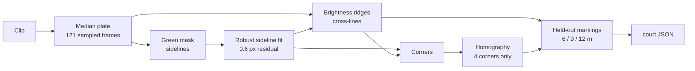

# Court Geometry

Everything downstream needs to know where things are on the floor: which detections
are players, which team a thrower belongs to, whether a release was legal, how far
outside the line is still court-adjacent, and how to compare a 280 px near player
with a 150 px far one. This layer answers all of that from a single fit.

| File | Role |
|---|---|
| `scripts/fit_court.py` | Fits the calibration from the clip, writes `data/court/<stem>.json` |
| `src/court.py` | Reads it: transforms, zone tests, team half, scale normalisation, foot points |
| `scripts/render_court_overlay.py` | Draws the fit over a frame, through the same reader |
| `src/overlay.py` | The overlay palette, shared with the labelling tool; see [[design-system]] |
| `scripts/test_overlay_contract.py` | Pins the tool's copy of the shared thresholds and colours to this one |
| `scripts/test_fit_court.py`, `scripts/test_court.py` | Checks over the writer and the reader; the whole suite is `scripts/test_*.py` |

## Challenges, and how the system gets around them

This is the honest core of the design. Each of these is a real property of the
footage, measured rather than assumed, and each is sidestepped rather than solved
head-on.

### Bystanders outnumber players three to one

The pose detector finds **38.0 people per frame** against 12 on court: sideline
queues, benches, referees, coaches, camera operators and a full crowd, all inside
the same frame and many wearing team kit. There are Canada supporters in red in
the stands, so an appearance filter cannot separate them.

*Circumvented by geometry.* Each detection is reduced to a foot point and tested
against the court polygon in court metres. That alone takes **38.0 → 9.7 per
frame, a 74% cut**, and the remainder sits just under the 12 a full set carries —
consistent with a set already carrying eliminations. Roster matching will later
provide a second, independent filter, so the two can disagree informatively rather
than one being trusted blindly.

### A threshold in pixels cannot be right at both ends

The camera is elevated and end-on, so one metre of floor spans roughly **190 px at
the near baseline and 45 px at the far one**. Any distance expressed in pixels —
"within N px of the line", "moved more than N px" — is necessarily wrong at one end
of the court whatever value it is given.

*Circumvented by working in metres.* The homography makes every position and
distance a court measurement. The out-of-play margin is 1.5 m everywhere, which is
a different pixel width at every row and correct at all of them.

### Far players are half the size of near ones

Median detection box height is **286 px in the near four metres and 150 px in the
far four**. A kinematic feature measured in pixels is not comparable between the
two ends, and the far team is exactly where the signal is already weakest.

*Circumvented by the horizon.* The court's cross-lines are image-horizontal, so
their vanishing point lies at infinity and the horizon is the horizontal line
through the sidelines' vanishing point, at **y = −331.4**. For a camera with a
known horizon, a vertical object of fixed height projects to a pixel height
proportional to `foot_y − horizon_y`. Dividing any pixel measurement by that makes
it scale-invariant, and the constant of proportionality — which would need the
camera height — cancels, so it is never needed. Checked against real detections:

| Court position | Detections | Median box height | Predicted |
|---|---|---|---|
| 0–4 m | 3375 | 286 px | 293 px |
| 4–8 m | 566 | 219 px | 227 px |
| 8–10 m | 626 | 152 px | 191 px |
| 10–14 m | 350 | 158 px | 163 px |
| 14–18 m | 4802 | 150 px | 141 px |

Within 2–6% everywhere except the 8–10 m band, which runs 20% short. That band is
the centre line, where players lunge and dive for balls, so the shortfall is a real
posture effect rather than a geometry error — which makes the residual a usable
signal rather than noise.

### The colour cue that finds the court dies at distance

The boundary is bright green tape on a grey floor, which separates trivially near
the camera. It does not survive perspective: green-channel dominance over the other
channels is **~50 at the near baseline and 4 at the far one**, fully desaturated by
lighting falloff and compression and indistinguishable from neutral white. A
colour-only detector finds three sides of the court and silently stops.

*Circumvented by using two cues for two jobs.* The sidelines run the full depth of
the frame and are fitted from colour, where it is strong. The cross-lines — including
both baselines — are found as narrow bright ridges in a brightness profile sampled
between the fitted sidelines, which works at both ends. The split is a consequence
of the measurement, not a preference.

### Players stand on the lines

Any single frame has twelve players on the court and more along its edges,
occluding exactly the markings the fit depends on.

*Circumvented by a median plate.* Players are transient and the floor is not, so a
per-pixel median over **121 frames spread across the clip** removes every person and
leaves the court fully exposed. Nothing downstream of the plate handles occlusion at
all. This is available only because the camera is fixed, and it is the single
property that makes the whole approach cheap.

### The floor carries three sports' markings

Volleyball attack lines, a badminton-height net rigged overhead, and two further
markings at 1.50 m and 16.43 m that match no volleyball feature. A generic
white-line detector has no way to know which rectangle is the court and would
happily fit the wrong one.

*Circumvented twice over.* Colour selects the taped court for the sidelines, and
the held-out check below rejects any fit whose interior structure is not a
regulation court. The two unidentified markings are recorded in the JSON **without
a semantic**, because guessing at one would be worse than admitting it.

### A wrong homography is perfectly self-consistent

This is the quiet failure. A fit with the wrong scale, or fitted to the wrong
rectangle, produces a homography that round-trips exactly, projects a beautiful
grid, and is wrong everywhere. Nothing internal to the fit can detect it.

*Circumvented by holding structure out.* Only the four corners enter the fit. The
interior markings must then land on their real-world positions:

| Marking | True | Fitted | Error |
|---|---|---|---|
| Volleyball attack line | 6 m | 6.061 m | +61 mm |
| Net / centre line | 9 m | 9.091 m | +91 mm |
| Volleyball attack line | 12 m | 12.090 m | +90 mm |

Sub-100 mm across an 18 m court, from evidence the fit never saw. This also
*identifies* the floor: three markings landing on 6/9/12 m is a regulation
volleyball court, **18 × 9 m**, which is where the court dimensions come from
rather than an assumption about what a dodgeball court measures. The fit aborts
if any held-out marking misses by more than 0.25 m, so a different venue fails
loudly instead of producing a plausible calibration that is wrong.

Corroborating this, the two unassigned markings sit at 1.50 m and 16.43 m —
symmetric about the centre to within 70 mm, which nothing in the fit arranged.

### A diving player's box does not touch the floor

Dodgeball players dive and lie prone constantly, and most of all at the centre
line where they lunge for balls. For a prone player the detection box bottom edge
is wherever the torso ends, which can place them metres from where they actually
are — and it lands them on the wrong side of the centre line, which would mean the
wrong team.

*Circumvented by using ankles.* `foot_point()` takes the visible ankle keypoints
and falls back to the box only when neither is confident. The source is returned
with the point, so the fallback rate is reported rather than hidden: on a full
12-player frame it is **zero**.

### Boundary flicker would read as an elimination

The observable that drives outcome resolution is a player crossing the boundary.
Detection noise on a player standing on the line would otherwise produce a stream
of departures and returns.

*Circumvented two ways.* The boundary test carries slack, and crossings are read
as **transitions rather than membership** — standing still inside the margin
generates no event. This matters concretely: the far-end queue stands within
about 1.5 m of the sideline and therefore sits inside the margin band, so band
membership alone could never have been used as a "recently exited" proxy.

#### The slack is spent in pixels, not metres

It was a flat 0.10 m and that failed, because a metre is not worth the same
everywhere. The camera is end-on, so on this clip's fit half a metre along the
court spans 49 px at the near baseline and 9.6 px at the far one. The same tenth
of a metre therefore bought ten pixels of ankle tolerance near the camera and
under two at the far baseline — less than the keypoint's own wobble — and the
far-side waiting line strobed in and out of play.

Measured over the clip with detections associated frame to frame, **142 of 156**
short excursions were at the far baseline, 9 at the near baseline and 7 at a
sideline, and 382 of 389 flickering frames carried real ankle keypoints rather
than the box fallback. The fault was the unit, not the detector.

`ANKLE_SLACK_PX` is a budget of ankle error in pixels, converted to metres at the
point where it is spent (`Court.slack_at`, one image row up from the foot point).
It is set from the 90th percentile of the overshoot on those flickering tracks,
which is 7.6 px. What that buys, and what a flat metre slack costs to match it:

| Rule | Short excursions that return | People per frame | Frames over 12 |
|---|---|---|---|
| 0.10 m flat | 160 | 9.18 | 3% |
| 0.40 m flat | — | 10.99 | 19% |
| 8 px | 68 | 9.66 | 4% |

The flat 0.40 m suppresses comparable flicker only by admitting the people
standing just behind the near baseline, where 0.40 m is forty pixels. The pixel
budget is 0.08 m at the near baseline and 0.43 m at the far one, so it is
simultaneously *tighter* than the old rule near the camera and four times looser
where the pixels are scarce. `MAX_BOUNDARY_SLACK_M` caps it for points projecting
near the horizon, and is held below `MARGIN_M` so the in-play test can never reach
into the crossing band.

A residual remains that is not a slack problem: occlusions and genuine brief steps
out. Those are absorbed by a hold instead.

#### Stepping out for a moment is not leaving the game

`IN_PLAY_HOLD_FRAMES` counts a player as in play if they were on court anywhere
within that window *either side* of the frame. Over the whole clip it takes
excursions that return from **107 to 13**, and the short ones — under a quarter of
a second, the ones that read as flicker — from **73 to 3**.

The window is symmetric rather than a timeout, and that is the load-bearing
detail. A causal "still counts for a second after they were last seen" rule makes
in-play depend on the direction the clip was played, so the same frame shows a
different roster depending on whether the annotator scrubbed forwards or backwards
onto it. What is drawn on a frame has to be a function of that frame alone.

Length is set from the same measurement: with the slack already spent in pixels, a
one-second hold absorbs 93 of the 113 excursions that returned and two seconds
buys four more, against twice the delay on a real exit — and a real exit is an
elimination, so the delay is not free.

The two sides identify the player differently, which is the one place they cannot
share an implementation. The pipeline has ByteTrack, so it holds *a track*. The
tool recomputes everything per frame by design and has no tracks, so it holds any
point within `HOLD_RADIUS_M` of where an on-court player stood on a nearby frame.
That approximation is sound for the case the hold exists to fix — a player
flickering at the baseline is standing still — and unsound only for someone
covering metres in a second, who is sprinting through mid-court where the boundary
is not in question. `scripts/test_overlay_contract.py` pins the window across
both.

### The same test, written twice, drifted

The labelling tool is TypeScript and the pipeline is Python, so every shared
threshold exists twice. "On court" diverged, and quietly: the pipeline tested the
paint plus 0.10 m of slack, while the tool tested the paint plus the whole 1.5 m
margin band. Both were internally consistent and both drew a plausible overlay,
but the tool put **22.1 people per frame** on the roster where the pipeline put
**9.1** — the eliminated queue, the officials and the front row of the crowd, each
consuming a player key. The margin band is the ring a crossing is *observed
through*, not a region of play, and as the flicker section above notes, it is
exactly where the people who are not playing stand.

| Rule | Foot point | Slack | People per frame | Frames over 12 |
|---|---|---|---|---|
| Tool, before | box bottom centre | 1.5 m (margin band) | 22.1 | 100% |
| Both, then | ankle keypoints | 0.10 m flat | 9.1 | 5.6% |
| Both, now | ankle keypoints | `ANKLE_SLACK_PX`, per row | 9.7 | 4% |

*Circumvented by pinning the copies to each other.* `scripts/test_overlay_contract.py`
reads the tool's constants out of its own source and asserts them against this
layer's, including that `margin_m` cannot appear in the in-play test at all. A
value that can only be declared twice is at least not allowed to differ twice.
The residual 5.6% of frames carrying more than twelve is not this defect: those
are the pre-set and post-set windows, below.

### Team attribution normally needs an appearance model

*Circumvented by the rules.* Teams may not cross the centre line, so the half a
player stands in gives their team directly. `Court.half()` is the whole
implementation. Jersey colour remains available as an independent cross-check
rather than as the mechanism, and has since been measured as one: over 1,608
on-court detections, torso colour puts the red kit in the near half **98%** of the
time and the white kit in the far half **99%**. The two signals share no
machinery, so a disagreement is informative — it means the foot point or the fit
is wrong, not that a player changed sides.

### Camera drift would invalidate everything silently

A pan, zoom or knock partway through the clip leaves the calibration pointing at
the wrong floor from that frame on, with no error raised — just slowly wrong
occupancy, wrong crossings, wrong outcomes.

*Circumvented by construction, not yet implemented.* Refitting on segments of the
clip and comparing homographies detects drift **and supplies the correction**,
where a separate static-camera check could only raise a flag. This is why no such
check exists. The fixed camera has not required it so far.

## How the fit works



Each row of the green mask contributes its leftmost and rightmost run as one point
per sideline, fitted by least squares with three rounds of outlier rejection.
Measured residual: **0.6 px standard deviation over ~720 inlying rows** per
sideline. A row only evidences court if it lands on *both* fitted sidelines, so the
span of jointly-inlying rows brackets the court and excludes green in the crowd and
on signage — the baselines are then the outermost ridges within that span plus a
small pad, since a full-width line leaves no left/right runs to separate and so
falls just outside the span itself.

Court coordinates are metres, x across the court and y along it from the near
baseline, so a position is meaningful without knowing which part of the image it
came from.

## Reader

```python
from court import Court, foot_point

court = Court.for_video("wdbf2014_final_h2_set2.mp4")
cx, cy = court.to_court(*foot_point(detection)[:2])
if court.on_court(cx, cy):
    team = court.half(cy)                      # "near" | "far"
    height = court.normalise(box_height, foot_y)   # comparable across the court
```

Transforms accept scalars or arrays. `on_court`, `in_margin`, `half`, `scale_at`
and `normalise` all vectorise, so a whole frame's detections classify in one call.

`on_court` and `in_margin` are disjoint and answer different questions. `on_court`
is the paint plus the slack that `slack_at` allows at that position, and means
*in play*. `in_margin` is the ring
outside it and means *court-adjacent* — somewhere a crossing can be observed, and
where the eliminated queue and the officials stand. Anything that needs a roster
wants the first; only crossing detection wants the second.

## Inspection

```
.venv/bin/python scripts/render_court_overlay.py data/footage/<clip>.mp4 --frame 625 --open
.venv/bin/python scripts/render_court_overlay.py data/footage/<clip>.mp4 --plate
```

Renders through the same reader the pipeline uses, so a render that looked right
while the pipeline was wrong would mean the two had diverged. The title bar counts
are the check worth reading — a live set is twelve players, six a side, split on
the centre line, with the box-fallback count at zero.

## Rejected alternatives

**A hand-drawn polygon.** Five minutes and exact, but it yields only a polygon: no
metres, so the margin band would have to be a per-region pixel guess; no scale
model; no way to notice the camera moving; and a committed file of pixel
coordinates a reviewer cannot re-derive or check. The fit produces all four from
one pass.

**Running inference on rectified imagery.** Warping the floor to a rectangle
equalises player scale directly, but a floor-plane homography stretches upright
bodies into shapes no pose model has been trained on. Scale is handled by
normalising features with the horizon relation instead, leaving pixels untouched.

**A separate static-camera probe.** Template-matching background patches would flag
drift but not correct it, and segment refitting gives both.

## Boundaries

- One calibration per clip; segment-wise refitting is designed for but not built.
- Geometry places the floor, not people. Deciding *who* is a player — as against a
  referee standing inside the lines — is left to roster matching, which fails them
  by construction. Measured, the gap this leaves is small during live play:
  officials survive the boundary test about **0.1 times per frame** (17 of 1,608
  on-court detections across 180 sampled live frames), because they work from the
  sidelines. It is not small during dead balls, where they walk the court to lay
  the balls out and the count reaches 17–18. That makes the filter a *when* rather
  than a *who*, which is what `SetTimeline.live_play_intervals()` in
  `src/setstart.py` supplies — gating on it removes the pre-set windows entirely
  and leaves 3.5% of live frames over twelve, all of them in the post-set huddle
  that the interval's bounded end cannot yet exclude. Nothing joins the two tests
  yet: a roster is still "on court", not "on court and in play". Officials do also
  separate on appearance if that is ever wanted — black tops measure V≈67 at low
  saturation against 138 for the red kit and 167 for the white.
- The dodgeball out-of-bounds is asserted to be the 18 m court boundary rather than
  the 1.50 m inset marking, on the evidence that players routinely stand between
  the two. Worth reconfirming from the foot-position distribution over the full
  pose run.

## On-disk contract

`data/court/<video-stem>.json`, `schema_version` 1. Committed; the plate and frame
renders beside it are footage-derived and are not.

| Field | Meaning |
|---|---|
| `clip_sha256` | The clip this belongs to; a mismatch means it is stale |
| `image_to_court` / `court_to_image` | 3×3 homographies, court units metres |
| `court_metres` | Width and length, asserted by the held-out check |
| `centre_line_m` | The line teams may not cross |
| `margin_m` | Court-adjacent band width |
| `horizon_y` | Image row of the horizon, for the scale model |
| `corners_image` | Fitted corners, near-left first, clockwise |
| `cross_lines` | Every detected marking, in image rows and court metres |
| `held_out_error_m` | Validation residuals, so a consumer can judge the fit |
