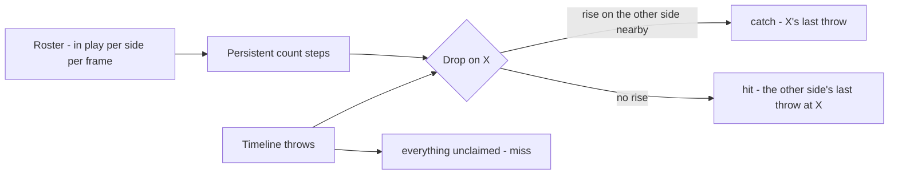

# Outcome

What a throw did — `hit`, `catch` or `miss` — read from the game rather
than from the ball. The last decision of the cascade and the numerator of
the metric.

| File | Role |
|---|---|
| `src/outcome.py` | Count steps, their attribution to throws, and the fold |
| `scripts/detect_events.py` | Runs it over the timeline's throws and writes `outcome` on each |
| `scripts/test_outcome.py` | Checks on steps, attribution and the fold |

Upstream: [[roster]] for who is in play, [[set-start]] for live play,
[[release-gate]] and [[destination]] for the throws. Downstream:
[[evaluation]] scores `outcome` and computes efficiency.

## Why the game and not the ball

The ball was tried first, and the plan had it the other way round: ball
for release, game state for outcome, on the argument that a noisy release
stream could be matched to a robust state-change stream. Measured on the
clip the argument holds, but for a narrower reason than the first version
of this doc gave: **the chain does not reach the contact.** At 25 fps and
twenty pixels the frame where the ball meets a player is the frame the
chain loses it, and for the next one to three frames the ball is against
the body, so a dodge and a hit both end the chain inside the box; letting
it run through the box only lets it grab the next orange thing (misses
then kink at 130–146°, hits at 4–137°). The ball's contact still names the
player it reached, and [[destination]] uses it; the chain cannot say what
happened next.

The rebound, though, is observable. On every visible hit on the clip the
ball is beside the player it struck for five frames or more at a fraction
of its incoming speed, and the colour mask sees it; after a miss nothing is
left near the player (`docs/figures/rebound-hits-v-misses.jpg`). Reading it
is a linking problem — occlusion at the body, held balls beside the target,
two balls at one player — that three quick attempts did not solve; it is
the next experiment in the README. Until then the game is the witness.

Two other witnesses were measured and set aside. The **whistle** band
(2.5–4.5 kHz) fires 56 times in three minutes at a floor low enough to
catch quiet calls — on pump fakes as often as throws, which is shoe squeak
and crowd; the dozen long, loud ones are real calls and precede far-side
outs by 9–100 frames, but two of them have no out behind them at all. The
**departure of a track** fragments: a player who leaves reads as an exit
and a re-entry under a new id in the same frame.

What holds is the **count of a side in play**, held for a while. In
dodgeball only a throw resolving changes it: a hit takes one off the side
struck, a catch takes the thrower off and returns one to the catcher's
side. A persistent step in the count is an outcome; the throw responsible
is the last one thrown at that side before it.

## How it works

`count_steps` reads each side's in-play count frame by frame across live
play (from `Roster.on_court`, which is the elimination curve the roster doc
already reports) and keeps a change only when the next `HOLD_S` of frames sit
at the new level, with `HOLD_SLACK_FRAMES` forgiven — a track that drops
out and back inside two seconds is the tracker, not a player.

`resolve` takes the drops in order. A drop on side X with an unused rise on
the other side inside `RETURN_WINDOW` is a **catch** of X's latest throw
before the earlier of the two; the return may precede the drop, because
the catcher's teammate walks on while the thrower is still walking off.
Otherwise it is a **hit** by the other side's latest throw before it. The
throw must fall within `ELIMINATION_WINDOW` — the slowest departure on the
clip is 141 frames after the hit, the slowest return 220 after the catch —
and resolves once. Every throw no step claims is a **miss**. A drop no
throw explains is written to the timeline as `unexplained_steps` rather
than dropped.

`fold` runs the resolved outcomes forward from the opening counts. On the
predictions it is the temporal prior the plan asked for; on the labels it
is an audit, and it is what found the two label corrections below.

## What it scores

On the clip, outcome on the 22 matched throws the pipeline called throws:
**59%** — 13 of 22. Predicted efficiency **near 5/17 against a truth of
4/15; far 1/13 against 2/14.** (It was 13 of 20 before the release gate's
faint tier found two more throws; both of those score wrong here, one of
them the set's last hit, below.)

The errors are three families, none a threshold:

- **Two throws at one side inside the window.** 1067 (hit) and 1077 (miss)
  are ten frames apart; the far side's drop at 1125 goes to the later one.
  The set's last hit is the same shape: [[set-end]] hands the final
  elimination to the latest unclaimed near throw in its window, and that is
  a second proposal of the throw before it (near-10 at 4656, the same ball
  as 4641), five frames after the true one (near-4C at 4647). One motion
  proposed twice is [[throw-candidates]]' to fold.
  The ball's contact was tried as the tie-break — it names the leaver for
  1067 — and it breaks the other such pair (4018's ball passes through the
  box of the player 4030 then hits). Latest-throw is kept and the case
  reported.
- **A return the roster never saw.** The truth throw at 2725 sits on a
  second, empty detection of its thrower, so the real thrower's proposal is
  unmatched — and it is that proposal the catch resolves to. Two far
  catches (2681, 2725) put two far players off and the count shows both
  departures (2813, 2898), but only one near player walking back on (2953,
  +1); the second departure has no return to pair with and falls to a
  held-ball false positive at 2749 as a hit. Both are the identity layer's.
  A rise of +k does explain k catches (`resolve` counts uses per rise),
  which matters once the roster sees both players return.
- **Blocks are misses.** Three of them. State cannot see a block, exactly
  as the plan said, and the metric does not need it.

## What the fold found in the labels

Folding the labelled outcomes from 6 v 6 reached 8 v −2 against an
on-court count that went 6 v 6 → 6 v 1. Two labels were wrong about the
game and right about the ball, and were corrected with the count as the
witness ([[wdbf-rules]]):

- **1485**, labelled a catch: no far player leaves and no near player
  returns; the count is flat. Now a block, as the annotator's own note
  ("block or catch, hard to see") allowed.
- **2701**, a hit on far-2 twenty-two frames after far-2's own throw was
  caught at 2681. He was already out and still walking off; under 19.1 only
  a live player can be put out. The label keeps `hit` and carries
  `eliminated: false`; the metric counts eliminations, not hits.

Three eliminating events on one player in 44 frames is what the roster
saw as two far outs and two near returns — which is what happened.

## Boundaries

- `block` is not claimed. A blocked ball stays live (21.2) and state does
  not move; the target's wrists showed a trace of it on the clip but too
  weakly to build on.
- No `target` is attributed here; [[destination]]'s contact names one
  where the chain reached a player.
- The window is the whole of the lag. A second throw at the same side
  inside it is attributed by recency, and the clip has one such pair.
- The final elimination is not a step: the last player is still on the
  paint while the floor fills, so the count rises rather than drops.
  [[set-end]] reads the end from that shape and traces the hit back to the
  latest unclaimed throw at the stand's side inside the hit window;
  `scripts/detect_events.py` applies it after `resolve`.
