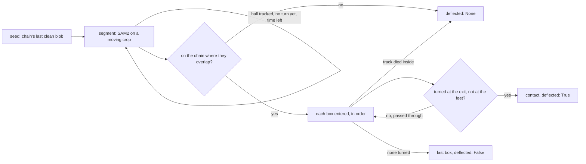

# Rebound — what the ball did at the player it reached

`src/rebound.py`, run inside `scripts/detect_events.py` for every throw with
a chain; tests in `scripts/test_rebound.py`.

## Purpose

[[outcome]] reads hits from the game — a persistent drop in a side's in-play
count — and attributes the drop to the last throw at that side. That rule
cannot split two throws at one side inside the elimination lag, and it
cannot see a block at all, because a blocked ball moves no count. This
stage is the second witness: it follows the ball to the player it reached
and *through* the contact, and reports whether it turned there. A ball that
comes back off a player struck them; a ball that carries on past did not.
Where two throws compete for one departure, the one whose ball turned takes
it; a ball that turned and put nobody out was blocked.

Upstream: [[release-gate]] for the chain, [[roster]] for every player's box.
Downstream: [[outcome]], which ranks hits by `deflected` and claims `block`
from it.

## Why the chain cannot see this, and a segmenter can

The chain links colour blobs frame to frame on a velocity prediction, and
it dies twice over at the target: it loses a fast ball short of the box
(4651's chain ends eight frames before the player), and where it does reach
the box the ball is against the body for a frame or three and comes out in
a new direction, which the prediction does not allow. The rebound itself is
plain to the eye and to the colour mask
(`docs/figures/rebound-hits-v-misses.jpg`); what was missing was a linker
that re-acquires on appearance rather than motion. SAM2 (Ravi et al., 2024)
is that linker: prompted with the ball on one frame it carries a memory of
what it looks like and finds it again after occlusion wherever it went.

Three cheaper readings were tried first and did not separate: continuing
the incoming line (a hit breaks it by definition), counting non-static
blobs in the target's box (held balls beside far-side players, two balls of
one double contaminating each other), and a greedy post-contact chain with
occlusion gaps (once gaps are allowed it hops to neighbouring balls).

## How it works

**Seed.** The chain's last point with a clean colour blob under it, looking
back `SEED_LOOKBACK_LINKS` from the end — the chain's last link is often
the one that went wrong. The prompt is a box on that blob, not a box of
nominal ball size: a prompt twice the ball segments the floor round it and
the tracker follows the floor. Chains shorter than the lookback are not
followed.

**Segments.** One tracker run is `SEGMENT_S` on a square crop round the
ball — sized by how far it moves in the segment and the court scale where
it is, resized to `CROP_SIDE_PX` — so a twenty-pixel ball is never handed
to the segmenter small. If the ball is still tracked and has not yet turned
at a player, the next segment is seeded from its last position and the crop
moves with it, up to `EXTEND_MAX_S` looking for a player plus
`FOLLOW_AFTER_S` past a contact. Each run is its own predictor: the video
predictor keeps a memory bank for the source it was set up on.

**Believed only on the chain.** Where the tracker and the chain overlap the
tracker must sit within `ON_CHAIN_NORM` of every chain point, else the run
is `seeded: false` and every verdict from it is None — a tracker that had
already left the ball has nothing to say about what it did next. Past the
seed the track ends at the first step longer than `JUMP_SPEED_FRAMES`
frames of the ball's speed plus `JUMP_SLACK_NORM`: six identical balls are
on court, and when the followed one leaves the crop the memory finds
another.

**Contact is where the ball turns, not the first box it enters.** In the
image a ball crosses the boxes of teammates and bystanders on its way; the
first box entered is not the player it reached. So every box the ball
enters (the thrower's own excluded) is tried in order, and the turn is
measured from the entry point to where the ball *leaves that box* — out the
far side it passed through, back out the near side it turned — or, where
it never leaves, over its first `TURN_SPAN_WIDTHS` player-widths. The first
box with a turn at or above `DEFLECT_MIN_TURN_DEG` is the contact and the
ball is `deflected`; a turn in the bottom `FLOOR_BAND` of a box is the
floor at the player's feet and is skipped, because a ball that bounces
beside a crouching player turns as sharply as one that hits them. A ball
that passes through every box it enters has its last box as contact and is
not deflected; one whose track dies inside a box has that contact and no
answer.

## What it measured

On the evaluation clip's 22 matched throws, the ball reached a player on 21
and turned at one on 6; every turn is a labelled hit or block, every
pass-through a labelled miss or a graze. Wired into [[outcome]] the clip
went from 13 of 22 by recency alone to **18 of 22**:

- 1067/1077, two near throws ten frames apart with one far departure: 1067's
  ball turns 77° at far-24, 1077's passes through far-27 at 1.5°; the
  departure is 1067's.
- 1451 and 1898, blocks: turns of 118° and 129° at near-7 with no count
  step; claimed as `block`.
- 2701, a hit on a player already out: with the two spurious near throws
  after it seen to carry on, the far departure at 2898 falls back to it
  rather than to a held-ball false positive.

What is still wrong: 3214 (block) — the track dies inside the box; 2681
(catch) — the roster never saw the return; and the set-ending double, where
both balls pass through far-27 with turns of 6° and 34° — a graze the label
calls a hit, under the threshold, and not tuned for.

Speed was the expected signal and is not: a rebound can come off at the
speed it went in.

## Design decisions

- **The count still says *that* someone left; the ball says *whose*.** For
  hits `resolve` ranks a ball seen to turn over no answer over a ball seen to
  carry on, and recency only inside a rank. No answer outranks a wrong
  answer.
- **A turn nobody left for is a block.** `blocks` runs after every step and
  the set end have taken their throws, so a deflection that did put someone
  out is never demoted; what is left turned and moved no count, which is
  what a block is (WDBF 21.2, the ball stays live).
- **Catches are not read.** A caught ball stops; its turn is small and says
  nothing recency does not. 2681 is the roster's to fix.
- **Threshold by eye, on this clip.** `DEFLECT_MIN_TURN_DEG` sits between
  the turns and the pass-throughs above; six visible hits is the sample.
  The second set is the blind test.

## Configuration

Weights at `weights/sam2_l.pt` (`scripts/download_weights.py`; Meta's
`sam2_hiera_large.pt` loads under the same name). Every window is a
duration converted at the clip's rate; the crop, tolerance and turn
constants are at the top of `src/rebound.py` and written to the timeline's
`thresholds`. `scripts/detect_events.py --no-rebound` runs outcomes by
recency alone, no blocks. Cost: about 3 s a throw for one segment, a model
load each, on the laptop GPU.

## Boundaries

- The final elimination is named by [[set-end]]'s tracer, not `resolve`,
  and the tracer does not consult `deflected`.
- Identical balls remain the failure mode. The jump cut catches the one
  instance on the clip; a ball crossing the crop at plausible speed would
  not be caught.
- A hit that barely bends the flight — the set's last, 34° — is under the
  threshold and reads as a pass-through.
