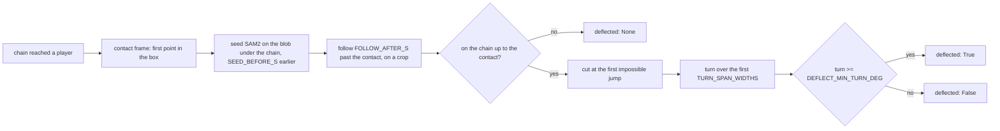

# Rebound — what the ball did at the player it reached

`src/rebound.py`, run inside `scripts/detect_events.py` for every throw whose
chain reached a player; tests in `scripts/test_rebound.py`.

## Purpose

[[outcome]] reads hits from the game — a persistent drop in a side's in-play
count — and attributes the drop to the last throw at that side. That rule
cannot split two throws at one side inside the elimination lag, and the
evaluation clip has two such pairs. This stage is the second witness: it
follows the ball *through* the contact and reports whether it turned. A
ball that comes back off a player hit them; a ball that carries on past did
not. Where two throws compete for one departure, the one whose ball turned
takes it.

Upstream: [[release-gate]] for the chain and [[destination]] for the player
it reached. Downstream: [[outcome]], which uses `deflected` as a tie-break
for hits only.

## Why the chain cannot see this, and a segmenter can

The chain in [[release-gate]] links colour blobs frame to frame on a
velocity prediction. At the target it dies for two reasons at once: the ball
is against the body for one to three frames, and when it reappears it is
moving in a new direction, which the prediction does not allow. The rebound
itself is plain to the eye and to the colour mask
(`docs/figures/rebound-hits-v-misses.jpg`); what was missing was a linker
that re-acquires on appearance rather than motion. SAM2 (Ravi et al., 2024)
is that linker: prompted with the ball on one frame it carries a memory of
what it looks like and finds it again after occlusion wherever it went.

Three cheaper readings were tried on the clip first and did not separate:
continuing the incoming line (a hit breaks it by definition), counting
non-static blobs in the target's box (held balls beside far-side players,
and the two balls of the set-ending double contaminating each other), and a
greedy post-contact chain with occlusion gaps (once gaps are allowed it
hops to neighbouring balls).

## How it works

For a throw with a contact, the **contact frame** is the first chain point
inside the contacted player's box (grown by `CONTACT_BOX_MARGIN`, as
[[destination]] grows it). The tracker is **seeded** `SEED_BEFORE_S` before
that frame with a box on the colour blob under the chain point — not a box
of nominal ball size, because a prompt twice the ball segments the floor
round it and the tracker follows the floor — and run to `FOLLOW_AFTER_S`
past the contact on a square **crop** round the contact point, sized by how
far the ball moves per frame and how big the player is, resized to
`CROP_SIDE_PX`. The crop is what lets a twenty-pixel ball survive the
segmenter's 1024-pixel input.

The result is read three ways before it is believed:

- **Seeded.** The tracker's centre must sit within `ON_CHAIN_NORM` of every
  chain point from the seed to the contact. A tracker that had already left
  the ball has nothing to say about what it did next.
- **Cut at a jump.** Past the contact the track ends at the first step
  longer than `JUMP_SPEED_FRAMES` frames of the incoming speed plus
  `JUMP_SLACK_NORM`. Six identical balls are on court; when the followed one
  leaves the crop the segmenter's memory finds another, and the jump is how
  that shows.
- **Turn over the first widths.** The angle between the chain's incoming
  velocity (the median of its last `VELOCITY_LINKS` steps) and the ball's net
  displacement over its first `TURN_SPAN_WIDTHS` player-widths out of the
  contact. Measured over the whole window instead, a miss that reaches the
  floor by the camera and bounces reads as a turn.

`deflected` is True at or above `DEFLECT_MIN_TURN_DEG`, False below, and
None where the run was not seeded or the ball was not followed past the
contact. The timeline carries all of it under `evidence.rebound`.

## What it measured

On the evaluation clip's 20 throws with a contact and a labelled outcome:

| Truth | Turn, degrees |
|---|---|
| hit | 153, 119, 144, 80, 30 |
| miss | 25, 14, 7, 8 |
| block | 117, 134, 12, 7 |
| catch | 17 |

Four runs were not seeded (two fast far-side throws, one seeded on a point
because no blob sat under the chain, one on a broken chain) and one track
died at the contact; those are None. The hit at 30° is a graze off a raised
arm that barely bends the flight. Two of four blocks show as deflections —
the first outcome signal for a block anything in the pipeline has had.
Speed was the expected signal and is not: 1067's rebound comes off at the
speed it went in.

Wired into [[outcome]] the clip's outcome went from 13 to 15 of 22: the
pair at 1067/1077 is split (1067's ball turns 119° at far-24, 1077's
reaches nobody). The set-ending pair is not — 4651's chain ends eight frames
before the player, so neither ball has a contact for the witness to speak
on.

## Design decisions

- **A tie-break, not a witness on its own.** The count still says *that*
  someone left; the rebound says *whose ball*. A deflection with no count
  step is not claimed as a hit — the two deflecting blocks are exactly that
  case, and a block is not a hit.
- **No answer outranks a wrong answer.** `resolve` ranks True over None over
  False: a ball seen to carry on is the last throw to be given a hit, a
  ball the tracker could not follow keeps its place by recency.
- **Fresh predictor per throw.** The video predictor keeps a memory bank for
  the source it was set up on; a throw's crop is its own source, so each
  gets its own. It costs a model load per throw (~3 s for SAM2-large on the
  laptop GPU) and buys no cross-talk between throws.
- **Threshold by eye, on this clip.** `DEFLECT_MIN_TURN_DEG` sits between
  the two groups above; six visible hits is the sample. The second set is
  the blind test.

## Configuration

Weights at `weights/sam2_l.pt` (`scripts/download_weights.py`; Meta's
`sam2_hiera_large.pt` loads under the same name). Every window is a
duration converted at the clip's rate; the crop and tolerance constants are
at the top of `src/rebound.py` and written to the timeline's `thresholds`.
`scripts/detect_events.py --no-rebound` runs outcomes by recency alone.

## Boundaries

- Speaks only where the chain reached a player's box; a throw whose chain
  ends short (4651 on the clip) gets no answer.
- Catches are not read. A caught ball stops; its turn is small and says
  nothing recency does not.
- The final elimination is named by [[set-end]]'s tracer, not `resolve`,
  and the tracer does not consult the rebound; on the clip neither ball of
  that pair had an answer, so nothing was lost.
- Identical balls remain the failure mode. The jump cut catches the one
  instance on the clip; a ball crossing the crop at plausible speed would
  not be caught.
