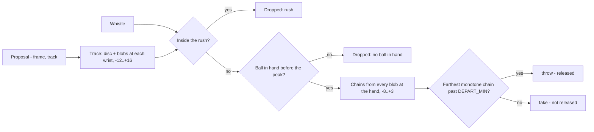

# Release Gate

From proposed throwing motions to events, and from events to releases. The
first two decisions of the cascade the plan set out — *is there an event
here* and *did the ball leave the hand* — made on the ball rather than the
body.

| File | Role |
|---|---|
| `src/ball.py` | The ball as colour: one read of the clip, what the mask sees at each wrist around every proposal |
| `src/release.py` | The two gates, the departure chain, and the timeline file |
| `scripts/detect_events.py` | Runs both over a clip, writes `data/timeline/<stem>.json` |
| `scripts/test_ball.py`, `scripts/test_release.py` | Checks on the mask, the disc, the chains and the gates |

Upstream: [[throw-candidates]] for the proposals, [[roster]] for the track
behind each, [[court-geometry]] for the perspective scale, [[set-start]] for
the whistle. Downstream: [[evaluation]] scores the file it writes.

## Why the ball and not the body

The candidate stage already asked the body everything it can answer. On the
truth set's sixty events and forty-five rejections, every pose feature tried
for *event or not* — wrist height at the peak, wind-up depth, arm extension,
elbow angle, torso tilt, body speed, speed decay — sat between AUC 0.4 and
0.7, and the one that had looked promising on twenty samples (wrist height,
0.85) fell to 0.69 on a hundred. For *fake or release* the first
experiments had found the same: a fake is the same motion with the ball
kept, and nothing about the motion says so.

The ball says so twice over. A throw or a fake is wound up *with a ball in
the hand*; the rejected proposals are sprints, dodges, pickups and pose
glitches, most of them empty-handed. And a throw's ball leaves; a fake's
does not. Both are visible to a colour mask at 20 px where a stock detector
drops out on exactly the blurred frames that matter.

## The ball as colour

`src/ball.py` reads the clip once, sequentially — the traced windows cover
half of it between them, and a decoder seek costs more than a decode — and
for every proposal and every frame from `TRACE_BEFORE` before its peak to
`TRACE_AFTER` after, records at each wrist:

- the orange inside a disc of `DISC_RADIUS_NORM` on the wrist keypoint,
  divided by the squared perspective scale so a near and a far ball count
  the same;
- every ball-sized orange blob within `BLOB_REACH_NORM` of the wrist, with
  its centroid and normalised diameter.

The wrist is the pose run's keypoint, carried from the last frame it was
seen when it is not. The disc is wider than a ball because the keypoint sits
at the joint and the ball in the palm is a hand's length beyond it.

**The colour range is not the set-start mask's.** The near team wears red,
and the set-start range (hue from 5) admits red: with it, a red sleeve at
the wrist read as a ball held through the whole of a fake, and two fakes the
annotator noted as *no ball at all* scored higher on ball-in-hand than most
throws. Measured on the clip, ball pixels sit at hue 6–14 and the jersey at
4–10; a floor at `BALL_HUE_MIN` = 9 keeps three quarters of the ball and a
fifth of a percent of the jersey. Set start keeps its own range: its balls
lie on the floor in a band no sleeve crosses.

**The blob filter is loose at the top.** A ball on the floor spans
0.020–0.036 of the scale; in flight it blurs into a streak several times
longer. `BLOB_DIAMETER_NORM` runs to four times the flight ball so the
streak is still a blob the chain can link to.

## Gate one: is this an event

Two structural cuts, then the ball.

**The rush.** Nothing within `RUSH_S` of the whistle. The balls are on the
centre line until the sprint reaches them, so no throw can exist; the four
proposals in that window on the clip were all sprinters, and the first
event is half a second after the gate closes.

**Set end** is not this layer's to know — it needs the outcome resolver —
so proposals in the post-set huddle pass through and the harness counts them
apart.

**Ball in hand.** The mean disc count at the fuller wrist over
`BALL_BEFORE_WINDOW`, the frames before the peak, must reach
`BALL_BEFORE_MIN`. The window stops three frames short of the peak: at the
whip the ball is a streak the disc may or may not catch, and a release
before the peak has already emptied the hand. The floor is set low on
purpose. Swept through the harness on the clip's 105 reviewed proposals, it
keeps every event the tolerance can match for precision 72%; raising it five
times buys no precision and loses eight events, and a missed candidate is
the one error nothing downstream repairs.

What the rule cannot cut is a ball held by a body doing something else:
hunkering down with a ball, blocking with it, raising a catch for the
referee, dodging with one in hand. Those are the twenty-three false
positives that remain, and they are the same class as a fake at the metric —
a ball that never crossed.

## Gate two: was the ball released

**Absence is not evidence.** The obvious test — the disc goes dark after the
peak — is AUC 0.75 on the clip and wrong in two systematic ways: a ball
tucked behind a body turned to the camera goes just as dark, and a second
ball held in the other hand keeps the disc lit through a real release. Both
were in the first experiments' misses and both are in the truth set.

So the claim is made on *seeing the ball leave*. From a blob at the hand —
within `HAND_NORM` of the wrist on any offset in `SEED_WINDOW` — chains of
blobs are followed frame by frame. The first step may be anything from
`FIRST_STEP_NORM` short to long, because there is no velocity yet to predict
from and a hard throw covers half the scale in a frame. Every later step
must land within `LINK_SLACK_NORM` plus `LINK_VELOCITY_FRACTION` of the last
step of where the last velocity predicts, and turn less than `MAX_TURN_DEG`.
The distance from the origin must grow at every step. Search is depth-first
over the nearest `BRANCH` blobs at each link, to `CHAIN_MAX_LINKS`.

Both wrists are tried and the longest chain, then the farthest, wins. The
pose's faster wrist at the peak is not reliably the throwing hand, and a
player holding two balls throws with one while the other stays lit.

The chain is a release when it reaches `DEPART_MIN_NORM` with at least
`CHAIN_MIN_LINKS` links: a hand cannot carry a ball a quarter of the scale
in two frames, and a ball in flight does it in one. Accuracy on the clip is
flat from 0.20 to 0.25 and falls either side.

**Why the seed window opens eight frames early.** The candidate's frame is
the wrist-speed peak, and the contact sheets show that peak is the whip or
the follow-through, not the release: at three of the first six throws
looked at, the ball is at the hand two frames before the peak and out of a
crop a quarter of the scale wide by the peak itself. A departure test
anchored on the peak misses those; anchored on the last frame the ball is
at the hand, it finds them.

## What it scores

On the evaluation clip, against the truth set, at the plan's tolerance of
±6 frames ([[evaluation]]):

| Level | Before this stage | With it |
|---|---|---|
| Candidate | P 56% R 98% F1 72% | **P 72% R 98% F1 83%** |
| Release, on matched events | not claimed | **78%** — fakes right 19 of 25, releases right 27 of 34 |
| Kind, on matched events | not claimed | 71% — every pass is called a throw, by design |

The one candidate miss is a throw whose peak landed twelve frames after the
labelled release; the annotator's own note calls that one late.

The release errors are readable. Six fakes called released are chains that
begin six to eight frames before the peak and end before it — a ball
arriving into the hand, or another ball crossing the wrist's neighbourhood
— and one is the annotator's *ambiguous* case where a fake turns into a dive.
Seven releases called fakes are a ball that leaves through the far side of
the body from the camera, or a far-court throw whose streak the mask loses
in the first frame. Neither family has a fix at one camera and 25 fps; both
are reported as what they are rather than tuned away.

## Configuration

Every threshold is a named constant at the top of `src/release.py` and
`src/ball.py`, and the timeline file records the set it was written with.
None is a confidence: the file carries the evidence behind every decision —
`ball_before`, `depart`, `links`, `seed_offset`, `wrist` — for dropped
proposals as well as events, so a threshold sweep reads the file rather than
the footage.

## The file

`data/timeline/<stem>.json`, schema 1: the clip hash and pose run, the
thresholds, `events` (proposals that passed gate one, each with `released`,
`kind` and its evidence) and `dropped` (the rest, each with why). Everything
that is not a fake is a `throw`; a pass is a throw to one's own side and its
separation needs the ball's direction in court metres, which is the next
stage's.

## Boundaries

- Thrower attribution is the proposal's: the roster's track and team. Not
  re-derived from the ball path, though a chain run backwards to the wrist
  it left is the better read and is the planned route.
- No outcome. The chain is followed only far enough to say the ball left;
  where it went and what it hit are the outcome resolver's, on the same
  blobs.
- One clip, one camera, one ball colour. The hue floor was measured against
  one red kit; a different kit is a new measurement, not a new design.
- Sixty events is enough to choose between rules and not enough to fit
  weights. A three-feature logistic model reached the same accuracy
  leave-one-out and was not kept: it explains nothing the two rules do not.
