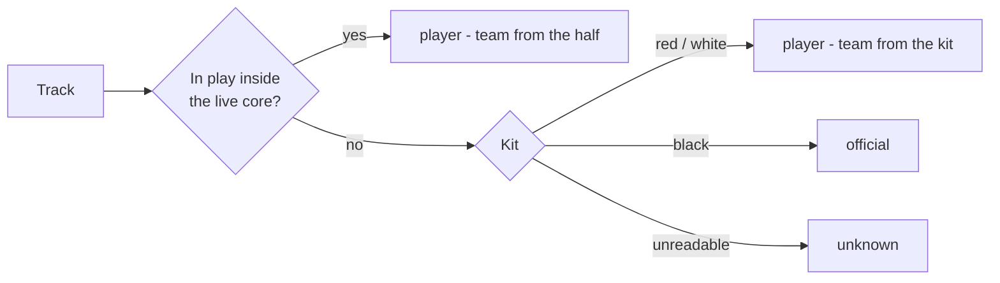

# The Roster

Who is on the floor: every tracked person in a clip, with a **role** (player,
official, unknown) and a **team** (near, far), at two grains — the track and the
person. It is the one structure that answers "is this box a player, and whose",
and every stage that needs that answer reads it rather than deriving its own.

| File | Role |
|---|---|
| `src/roster.py` | The schema, the classification rules, and the `Roster` reader with its queries |
| `scripts/identify_players.py` | The identity pass: tracks, numbers, roles, sides, joins - writes `data/roster/<stem>.json` |
| `scripts/test_roster.py` | Checks on the rules, the queries, and the evaluation clip |

Upstream: [[pose-precompute]] for the detections, [[court-geometry]] for the
halves and the in-play test, [[set-start]] for when a set is live, and
[[player-identity]] for the tracks and the numbers on them.

## Why a roster and not a flag

A list of tracker spans with a jersey number where one was confirmed - which is
what the identity pass first wrote - does not say whether a span was a player,
a referee or someone on the bench, nor which side a player was on. Both are
derivable, which is the problem. The candidate detector must not propose a referee's arm;
attribution must name a side; occupancy per side is the elimination stream.
Each of those re-deriving "is this a player" from geometry is how the same test
gets written twice and drifts, which [[court-geometry]] records happening once
already with `isOnCourt`.

So the same pattern as the court fit and the set timeline: one writer, one
reader, and no stage re-derives what another already decided.

## Two grains

A **track** is one tracker span. It carries the role and team decided for it,
every frame it holds — as `(frame, index)` pairs into the pose run, so the box
and keypoints live in one place and the roster only points at them — and the
frames the player counted as in play, as intervals.

A **participant** is a person: the tracks the identity pass joined by side and
number ([[player-identity#Fragments are joined by their number]]), or a single
track where no number was read. The side comes first because numbers are per
team: #2 and #13 on the evaluation clip are USA, and a near-side 44 and a
far-side 44 would be two people. Attribution wants this grain; the
candidate detector wants the track. Participant ids are `near-7` for a numbered
player and `<role>-t<track>` otherwise, so an id says what is known about the
person and nothing more.

### Player against played

`player` is a role, and it is wider than "played the set": a team kit on a
track never seen in play is a player waiting to rush, eliminated, or on the
bench, and the roster keeps them because attribution and the candidate
detector still need to know a box in red is not an official. The question the
roster cards, the occupancy stream and attribution ask is narrower — who was
on the court while a set was live — so each participant also carries
`played_sets`: every set whose live core held their tracks in play for at
least `PLAYER_MIN_CORE_FRAMES`, the same evidence that made those tracks
players, summed over the person; `played` is whether that names any set. The
roster writes the decision down; readers do not re-derive it.

It is per set, not a total, because the roster panel filters by set and a
clip holds more than one: a player who sits the second set out played the
first, and a total of core frames cannot say which. The threshold is judged
set by set — a second inside one set's core, not a second spread over
several — so `played_sets` is the decision and `played` follows from it,
never the other way round. On a one-set clip the two say the same thing.

Sets are named by their index into the timeline's `sets` as written, counting
the layouts that never got a whistle, so that the tool's "set 2", the
interval's `set_index` and the roster's `played_sets` all name the same set
(see [[set-start#Live-play intervals]]).

### Pieces are folded by who is missing from the six

The tracker does not hold anyone for a whole set. A player comes out as
several tracks, and the number joins the pieces it was read on
([[player-identity#Fragments are joined by their number]]) — but a piece it
was never read on is left as its own nameless "person", and on the clip that
made 22 who played out of 12 who did. The rule that names those pieces is the
same rule that decides role: **only a side's six players are inside its
court while a set is live** ([[wdbf-rules]]). For a piece in play on a side
during a set, the candidates are that side's players for that set with no
track on court at the time; exactly one candidate is the answer
(`players.fold_by_occupancy`, run to a fixpoint because one fold can make the
next unambiguous).

Three things keep it exact rather than a guess:

- **The count never overrules the reader.** A piece that read a number often
  enough to claim it, short of confirming it, can only be folded to that
  number; if the count rules that player out, the piece is left unnamed and
  the pass reports the disagreement. This is what caught the first wrong fold
  on the clip: a piece the count named #4C had read `44` nine times, and the
  crops showed why — it was two players, swapped between tracks at 0:14
  ([[player-identity#A track can change player, and the number is what shows it]]).

- **It keeps silent where it cannot know.** With fewer than six of a side's
  players numbered for the set, the sixth is an unknown who is always a
  candidate, so no piece is named. With two players missing at once and no
  seam (below), the piece stays unnamed and the panel shows it as such.
- **Position tells a hand-over from two players.** A player's own track can
  linger a few frames on the body the new track has taken, and a player who
  was lost can be picked up again a few frames later. Both look like "absent"
  in the frame arithmetic alone, and both look like a second player. So a
  short overlap counts as present unless the two tracks sit on one box
  (`tracking.tracks_together`, median IoU over the shared frames), and where
  two players are missing at once, the one whose track ended within a second
  of the piece starting, within most of a box height of it, is the piece
  (`tracking.tracks_continue`). Both thresholds were set on this clip's seams
  — 8–10 frames and 0.05–0.44 heights against the nearest wrong seam at 115
  frames and 2.3 heights — and are the first thing to check on other footage.

A piece in play while all six are already tracked is a **seventh body**, and
no player: a second track on one player, or a non-player given the role.
It keeps the `player` role (its box is still not an official's) but is marked
`excess`, never counts as having played, and is listed for inspection rather
than hidden. `Roster.excess()` and the tool's footnote name them.

On the clip exactly 12 played, six a side. Seven pieces folded: USA #2
before the reader got the number at 1:18 (three pieces, the last by the
seam); near #10 and #18 one each; and #4C twice — 2:12–2:15 by elimination
once #18's piece was named, and 0:14–0:28, the tail cut off track 49 when
the swap with SARAULT 44 was found. Three near-side pieces at 1:50–1:58 and
2:23–2:27 are excess. Every fold was checked against the jersey crops. The rest are kit-only tracks with no in-play frames (the queue,
the bench, the pre-rush crowd) and the walk-ons after the core ends.
`test_exactly_the_twelve_played_and_the_seventh_bodies_are_excess` pins it.

## How role is decided

The rule of the game does most of the work: **nobody but a player is inside
the court while a set is live.** A track with in-play frames inside the *live
core* of a set is a player, whatever they are wearing.

That matters because kit colour alone cannot be trusted. Referees on the
evaluation footage wear black with white shoulder panels; USA #2 wears a white
jersey with a large black print across the chest, and reads
black on 0.43 of the chest from the front — as dark as a referee's shirt.
Nothing in the pixels separates that jersey from an official's; the fact that
its wearer is inside the court in live play does, every time.

Only for tracks never seen in live play does kit decide: black is an official;
a team kit is a player waiting to rush, eliminated, or on the bench; a track
with too few clean crops to vote is `unknown` rather than guessed.

### The live core

The live-play interval from [[set-start]] has an exact start (the whistle) and
a bounded end (the next ball layout), and the bound overshoots: officials walk
the court to lay balls out and the huddle stands inside the lines, so a
referee's track that exists only in that stretch is "in play" for most of its
life. Track 347 on the clip is 69% in play and is a referee laying balls out.

The core is therefore the start plus `LIVE_CORE_S` (150 s), clipped to the
bound. Sets on this footage run three minutes and more, so no set ends inside
its core, and a referee inside the court during it would be a rule violation
rather than a false positive. On the clip every black-kit track with in-play
frames inside the core is USA #2 or a fragment of them (19, 137, 127, 212);
all 33 others — the four referees and the court-side staff — have none.
`test_no_official_is_in_play_during_the_live_core` holds that.

[[set-end]] now reads the end from the floor, but the core stays at the
constant: the floor end is a bound, and inside the last stand an official's
track (307) reads in play for 71 frames — a core that reached it would call
that track a player. See [[set-end#What changes downstream]].

### Kit is read from the chest

A box-based torso crop — the top 60% of the box, which is what the jersey
reader uses — drags in hair, sleeves and background until a white jersey with
black sleeves and a black shirt with white panels measure alike (black 0.25–0.31
against 0.30–0.38 on the clip). The strip between the shoulder and hip
keypoints, trimmed to stay off the arms, does not: referees measure 0.64–0.91
black, Canada 0.58–0.87 red, USA 0.40–0.74 white.

A crop votes only when one colour covers at least `KIT_MIN_COVERAGE` of the
chest and twice the runner-up; a track is named only when `KIT_MIN_SAMPLES`
crops have voted and `KIT_MIN_AGREEMENT` of them agree. The print on a jersey
is what pulls a crop below the floor, and abstaining there is the right answer.
Black kit also catches court-side staff in black t-shirts; the roster calls
them officials too, because nothing downstream needs to tell a referee from a
photographer — only a player from everyone else.

## How team is decided

The half a player stands in while in play is definitive — teams cannot cross
the centre line — so it wins whenever there is one, as the modal half over the
track's in-play frames. Kit fills in for tracks never in play, through a
`sides` mapping the roster learns from the players it saw in live play
(`red → near`, `white → far` on the clip) rather than from anything hand-set.
Every track records `team_source` so a consumer can tell the two apart, and a
kit mapped to a side that disagrees with a half is reported by the builder;
there are none on the clip.

## The file

`data/roster/<stem>.json`, one per clip. Records the clip hash and pose run it
was built from, and `Roster.check_clip` refuses a roster from a different cut.
The thresholds a run used are written alongside the result.

| Field | On | Meaning |
|---|---|---|
| `role` | both | `player`, `official`, `unknown` |
| `team` | both | `near`, `far`, or null for an official or an unplaced unknown |
| `team_source` | tracks | `half` or `kit` — how the side was decided |
| `kit`, `kit_share` | tracks | The colour voted and how much of the vote it took |
| `number` | both | The player's number, if known |
| `number_source` | tracks | `read` off the jersey, or `occupancy` — folded into the one player missing from the six |
| `readings` | tracks | Every number the reader returned on the track, as `(frame, number, confidence)` - the evidence behind `number` |
| `core_in_play_by_set` | both | In-play frames inside each set's live core, as `[set, frames]` — the evidence for `player` on a track and `played_sets` on a person |
| `core_in_play_frames` | both | The same over every set |
| `in_play` | tracks | Inclusive frame intervals where the player counted as in play |
| `detections` | tracks | `(frame, index)` into the pose run's detections for that frame |
| `track_ids` | participants | The tracks that were this person, in order worn |
| `played_sets` | participants | The sets they were on the court for while live, by index |
| `played` | participants | On the court while any set was live |
| `excess` | participants | In play while the side already had six — a seventh body, never counted as played |
| `sides` | file | Which side wears which kit, as learned |
| `live_cores` | file | The frames the `player` rule was judged over, as `[set, start, end]` |

## Queries

`Roster.for_video(stem)` loads it. The queries are the reason the structure
exists, so they are the test of its shape:

| Query | Answers |
|---|---|
| `at(frame, role=None)` | Everyone tracked on a frame: track, participant, detection index, in play or not |
| `on_court(frame)` | Players in play by side — the occupancy a set is scored on |
| `in_play(track_id, frame)` | Whether a track counted as in play on a frame |
| `players(team=None)`, `officials()`, `unknown()` | Participants by role, optionally by side |
| `excess()` | The seventh bodies, for inspection |
| `played(team=None, set_index=None)` | Who was on the court while a set was live — any set, or one — the roster the cards and attribution want |
| `player_tracks(team=None)` | Tracks by role and side, for stages that work per track |
| `participant_of(track_id)` | The person a track belongs to |

On the clip `on_court` reads 6 v 6 at the rush and 6 v 1 by frame 4500 — the
elimination curve, without a ball ever being tracked.

The labelling tool reads the same file through `RosterIndex`
(`tools/labeler/src/lib/roster.ts`): `trackAt(frame, index)` and `inPlay(track_id,
frame)` mirror `at` and `in_play`, `isPlayerInPlay(frame, index)` is the two
together, and `played(team?, set?)` mirrors `played`, numbered players first —
it is the players list in the tool's panel, filtered by set and side, and
`trackOnFrame` / `firstInPlay` are how a row takes the stage to its player.
`isPlayerInPlay` decides who gets a player key on a frame. The tool's own
geometry — the paint, the boundary slack, the hold window — admits whoever stands
within the slack of the line, and on a crowded sideline that handed keys to the
eliminated queue and an official while players in play ran past the end of the
six-key row. The roster decided in play once over the whole track with the same
slack and window, and it knows who is not a player, so with a roster present the
tool takes its word and the geometry only stands in when there is none. A key is
still a placement aid on one frame and the label still stores the box; see
[[labeling-tool#Resolved]].

## How it is built

The identity pass (`scripts/identify_players.py`, [[player-identity]]) writes
the roster in the same run that tracks the players and reads their numbers. It
holds every track with its detections in memory, so it can record which box on
which frame was the player without any second stage having to reproduce the
tracker; and it samples the chest for kit in the same pass over the video that
takes the jersey crops. The order inside the run is: track, read numbers, cut
switched tracks, then role and side per track, then join by side and number,
then fold the unnamed pieces by occupancy, then write.

The first version was a separate builder that re-ran ByteTrack over the pose
run and replayed the identity pass's cuts from a players file, relying on the
tracker being deterministic and asserting the spans matched. It was retired
once the identity pass wrote the roster itself: two files meant two clip hashes
to check and one silent way to drift.

## Boundaries

- Role and team are decided per track and never edited by hand. A wrong
  decision is a threshold or a rule to fix, so that the next clip gets it too.
- The kit palette (red, white, black) is the evaluation footage's. Another
  match needs its own colour limits; the rule that live play outranks kit does
  not change.
- `unknown` is a real answer. 123 of 224 tracks on the clip are short spans
  never seen in live play with no readable kit — mostly the pre-set crowd and
  the huddle — and naming them would be guessing.
- The roster does not tell a referee from a court-side photographer; both are
  `official`, because both are "not a player" to everything downstream.
