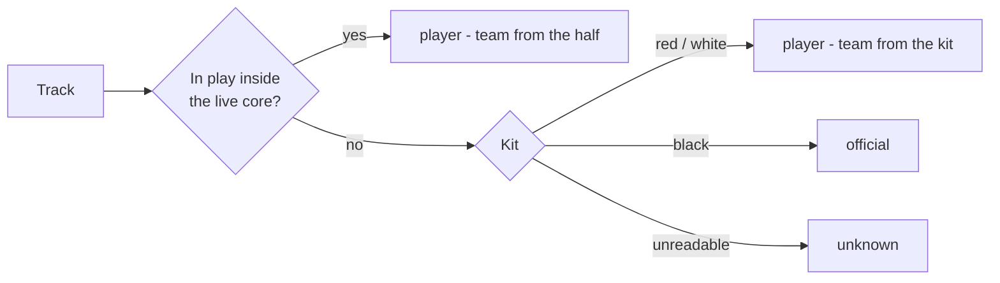

# The Roster

Who is on the floor: every tracked person in a clip, with a **role** (player,
official, unknown) and a **team** (near, far), at two grains — the track and the
person. It is the one structure that answers "is this box a player, and whose",
and every stage that needs that answer reads it rather than deriving its own.

| File | Role |
|---|---|
| `src/roster.py` | The schema, the classification rules, and the `Roster` reader with its queries |
| `scripts/identify_players.py` | The identity pass: tracks, numbers, roles, sides, joins - writes `data/roster/<stem>.json` |
| `scripts/test_roster.py` | Checks on the rules, the queries, and the evaluation clip |

Upstream: [[pose-precompute]] for the detections, [[court-geometry]] for the
halves and the in-play test, [[set-start]] for when a set is live, and
[[player-identity]] for the tracks and the numbers on them.

## Why a roster and not a flag

A list of tracker spans with a jersey number where one was confirmed - which is
what the identity pass first wrote - does not say whether a span was a player,
a referee or someone on the bench, nor which side a player was on. Both are
derivable, which is the problem. The candidate detector must not propose a referee's arm;
attribution must name a side; occupancy per side is the elimination stream.
Each of those re-deriving "is this a player" from geometry is how the same test
gets written twice and drifts, which [[court-geometry]] records happening once
already with `isOnCourt`.

So the same pattern as the court fit and the set timeline: one writer, one
reader, and no stage re-derives what another already decided.

## Two grains

A **track** is one tracker span. It carries the role and team decided for it,
every frame it holds — as `(frame, index)` pairs into the pose run, so the box
and keypoints live in one place and the roster only points at them — and the
frames the player counted as in play, as intervals.

A **participant** is a person: the tracks the identity pass joined by side and
number ([[player-identity#Fragments are joined by their number]]), or a single
track where no number was read. The side comes first because numbers are per
team: #2 and #13 on the evaluation clip are USA, and a near-side 44 and a
far-side 44 would be two people. Attribution wants this grain; the
candidate detector wants the track. Participant ids are `near-7` for a numbered
player and `<role>-t<track>` otherwise, so an id says what is known about the
person and nothing more.

## How role is decided

The rule of the game does most of the work: **nobody but a player is inside
the court while a set is live.** A track with in-play frames inside the *live
core* of a set is a player, whatever they are wearing.

That matters because kit colour alone cannot be trusted. Referees on the
evaluation footage wear black with white shoulder panels; USA #2 wears a white
jersey with a large black print across the chest, and reads
black on 0.43 of the chest from the front — as dark as a referee's shirt.
Nothing in the pixels separates that jersey from an official's; the fact that
its wearer is inside the court in live play does, every time.

Only for tracks never seen in live play does kit decide: black is an official;
a team kit is a player waiting to rush, eliminated, or on the bench; a track
with too few clean crops to vote is `unknown` rather than guessed.

### The live core

The live-play interval from [[set-start]] has an exact start (the whistle) and
a bounded end (the next ball layout), and the bound overshoots: officials walk
the court to lay balls out and the huddle stands inside the lines, so a
referee's track that exists only in that stretch is "in play" for most of its
life. Track 347 on the clip is 69% in play and is a referee laying balls out.

The core is therefore the start plus `LIVE_CORE_S` (150 s), clipped to the
bound. Sets on this footage run three minutes and more, so no set ends inside
its core, and a referee inside the court during it would be a rule violation
rather than a false positive. On the clip every black-kit track with in-play
frames inside the core is USA #2 or a fragment of them (19, 137, 127, 212);
all 33 others — the four referees and the court-side staff — have none.
`test_no_official_is_in_play_during_the_live_core` holds that.

When set end is detected the core becomes the whole set and the constant goes.

### Kit is read from the chest

A box-based torso crop — the top 60% of the box, which is what the jersey
reader uses — drags in hair, sleeves and background until a white jersey with
black sleeves and a black shirt with white panels measure alike (black 0.25–0.31
against 0.30–0.38 on the clip). The strip between the shoulder and hip
keypoints, trimmed to stay off the arms, does not: referees measure 0.64–0.91
black, Canada 0.58–0.87 red, USA 0.40–0.74 white.

A crop votes only when one colour covers at least `KIT_MIN_COVERAGE` of the
chest and twice the runner-up; a track is named only when `KIT_MIN_SAMPLES`
crops have voted and `KIT_MIN_AGREEMENT` of them agree. The print on a jersey
is what pulls a crop below the floor, and abstaining there is the right answer.
Black kit also catches court-side staff in black t-shirts; the roster calls
them officials too, because nothing downstream needs to tell a referee from a
photographer — only a player from everyone else.

## How team is decided

The half a player stands in while in play is definitive — teams cannot cross
the centre line — so it wins whenever there is one, as the modal half over the
track's in-play frames. Kit fills in for tracks never in play, through a
`sides` mapping the roster learns from the players it saw in live play
(`red → near`, `white → far` on the clip) rather than from anything hand-set.
Every track records `team_source` so a consumer can tell the two apart, and a
kit mapped to a side that disagrees with a half is reported by the builder;
there are none on the clip.

## The file

`data/roster/<stem>.json`, one per clip. Records the clip hash and pose run it
was built from, and `Roster.check_clip` refuses a roster from a different cut.
The thresholds a run used are written alongside the result.

| Field | On | Meaning |
|---|---|---|
| `role` | both | `player`, `official`, `unknown` |
| `team` | both | `near`, `far`, or null for an official or an unplaced unknown |
| `team_source` | tracks | `half` or `kit` — how the side was decided |
| `kit`, `kit_share` | tracks | The colour voted and how much of the vote it took |
| `number` | both | The jersey number the identity pass confirmed, if any |
| `readings` | tracks | Every number the reader returned on the track, as `(frame, number, confidence)` - the evidence behind `number` |
| `core_in_play_frames` | tracks | In-play frames inside the live core — the evidence for `player` |
| `in_play` | tracks | Inclusive frame intervals where the player counted as in play |
| `detections` | tracks | `(frame, index)` into the pose run's detections for that frame |
| `track_ids` | participants | The tracks that were this person, in order worn |
| `sides` | file | Which side wears which kit, as learned |
| `live_core` | file | The frames the `player` rule was judged over |

## Queries

`Roster.for_video(stem)` loads it. The queries are the reason the structure
exists, so they are the test of its shape:

| Query | Answers |
|---|---|
| `at(frame, role=None)` | Everyone tracked on a frame: track, participant, detection index, in play or not |
| `on_court(frame)` | Players in play by side — the occupancy a set is scored on |
| `in_play(track_id, frame)` | Whether a track counted as in play on a frame |
| `players(team=None)`, `officials()`, `unknown()` | Participants by role, optionally by side |
| `player_tracks(team=None)` | Tracks by role and side, for stages that work per track |
| `participant_of(track_id)` | The person a track belongs to |

On the clip `on_court` reads 6 v 6 at the rush and 6 v 1 by frame 4500 — the
elimination curve, without a ball ever being tracked.

## How it is built

The identity pass (`scripts/identify_players.py`, [[player-identity]]) writes
the roster in the same run that tracks the players and reads their numbers. It
holds every track with its detections in memory, so it can record which box on
which frame was the player without any second stage having to reproduce the
tracker; and it samples the chest for kit in the same pass over the video that
takes the jersey crops. The order inside the run is: track, read numbers, cut
switched tracks, then role and side per track, then join by side and number,
then write.

The first version was a separate builder that re-ran ByteTrack over the pose
run and replayed the identity pass's cuts from a players file, relying on the
tracker being deterministic and asserting the spans matched. It was retired
once the identity pass wrote the roster itself: two files meant two clip hashes
to check and one silent way to drift.

## Boundaries

- Role and team are decided per track and never edited by hand. A wrong
  decision is a threshold or a rule to fix, so that the next clip gets it too.
- The kit palette (red, white, black) is the evaluation footage's. Another
  match needs its own colour limits; the rule that live play outranks kit does
  not change.
- `unknown` is a real answer. 123 of 224 tracks on the clip are short spans
  never seen in live play with no readable kit — mostly the pre-set crowd and
  the huddle — and naming them would be guessing.
- The roster does not tell a referee from a court-side photographer; both are
  `official`, because both are "not a player" to everything downstream.
