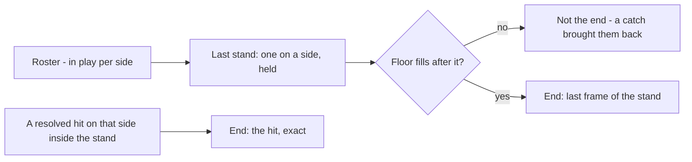

# Set End

Where a set ends: on the hit that puts out the last player of a side, or —
without the hit — where the floor shows that it happened. It closes the
live-play interval that [[set-start]] opens, and names the one elimination
the outcome stage cannot see.

| File | Role |
|---|---|
| `src/setend.py` | The last stand, the flood, the end they give, and the trace-back to the throw |
| `scripts/detect_set_end.py` | Runs it per set from the roster and writes `end` into `data/sets/<stem>.json` |
| `scripts/detect_events.py` | Uses the end to name the final hit ([[outcome]]) |
| `scripts/test_setend.py` | Checks on each rule, and the clip against the truth set's own end |

Upstream: [[roster]] for who is in play, [[set-start]] for the start and the
layout bound. Downstream: everything that asks `SetTimeline.interval_for`,
and [[outcome]] for the last hit.

## The moment and the bound

A set is won when a team has eliminated every player on the other side
(WDBF 10.2.1, [[wdbf-rules]]). So the end is one hit — the one on the last
player standing — and the frame the ball goes dead after it. That is the
moment, and it is what the truth set uses ([[evaluation#Set end falls out of the last hit]]).

The pipeline does not always have that hit. What it always has is the roster's
count of each side in play, and the count has a shape no set can produce
except by ending:

1. **The last stand.** One side is down to a single player and stays there for
   `LAST_STAND_MIN_S`. On the clip the far side reads one from frame 4051 to
   4660 — 610 frames — and reads one nowhere else in the set.
2. **The flood.** After the stand, the total in play rises by `FLOOD_MIN_RISE`
   or more and holds, within `FLOOD_WINDOW_S`. On the clip it goes 7 → 8 →
   9 → 11 between 4661 and 4772: both teams walking on to shake hands.

The last frame of the stand is the **floor end**, and it is a bound: the true
end lies at or before it. On the clip the floor end is 4660 and the truth
end — the ball dead after the hit at 4651 — is 4660. The two agree because the
first body to walk on came the frame after the ball died; in general the hit
player may stand alone for a while before anyone moves, and the stand's end
would trail the hit by that much.

Where a hit on the stand's side is known and lies inside the stand, the end
is the hit and `source` is `hit`; otherwise `source` is `floor`. Either way
the interval carries `end_is_bound` for what it is.

## Why the flood and not a rule

Play has rules the floor breaks the instant a set is over — a side above six,
an official inside the lines — and each was measured as a signal. Neither is a
single-frame fact on tracked footage. A side reads seven for runs of up to 45
frames in mid-set when a tracker fragment doubles a player (near reads seven
at 2777–2821, 2892–2952, 3581–3614, all during play); an official's track,
307, reads in play for 71 frames at 4419 in the middle of the last stand.
What no set can do is put two or more extra bodies on the floor at once: a
catch returns exactly one player, and nothing else returns any. The flood is
that, held for `FLOOD_MIN_S`, and it is also what tells a last stand from a
side a catch brought back from the brink — the latter has play after it, not
a flood.

## Why not the whistle

Every elimination on the clip has a whistle the set-start detector's gate
hears (1030, 1229, 1924, 3222, 3852, 4043, 4608 …), and the elimination that
ends the set does not: the last whistle above 20 dB is at 4608, the far
player's own hit on a near player, and nothing follows the final hit at 4651.
It is match point of a final, and the crowd lifts the floor the whistle is
measured against. The end whistle is corroboration where it is audible, and
[[outcome]] found the band unreliable during play for the same reason.

## The trace-back

The final elimination never steps the count. The player hit is still on the
paint while the floor fills, so `count_steps` in [[outcome]] sees a rise, not
a drop, and the last throw would be scored a miss. The end says where the hit
was: the hit window runs from the stand's first frame to the flood, and the
latest throw by the other side at the stand's side inside it is the hit.
`scripts/detect_events.py` applies that after the step resolver, only to a
throw no step already claimed.

This is what the end is for when a hit is missed: the window on the clip is
4051–4722, and the truth's last hit lies inside it. It is also honest about
its limit — the trace-back names the latest throw in the window, and on the
current timeline that is the near throw at 4641, ten frames before the truth's
4651, which the release gate did not call a throw.

## The file

`scripts/detect_set_end.py` writes an `end` block on each confirmed set in
`data/sets/<stem>.json`; the reader in `setstart.py` takes the end from it and
falls back to the layout bound where there is none.

| Field | Meaning |
|---|---|
| `frame`, `end_s` | The end |
| `source` | `hit` — the elimination of the last player; `floor` — the last frame of the last stand |
| `side` | The side that was down to one |
| `last_stand` | Inclusive frames the stand held |
| `flood_frame` | Where the total in play rose and stayed |
| `hit_frame` | The hit's dead-ball frame when `source` is `hit` |

`LivePlayInterval.end_source` reports `hit`, `floor`, `layout` or `clip`, and
`end_is_bound` is true for all but `hit`.

## What changes downstream

The live-play interval on the clip now runs 433–4660 rather than 433–4920.
Proposals, events and outcomes computed under the old bound include motions
from the walk-on; `test_nothing_is_proposed_outside_live_play` fails against
those files until `scripts/detect_candidates.py` and `scripts/detect_events.py`
are re-run.

The roster's live core does **not** yet extend to the end. The floor end is a
bound, and inside the stand an official's track reads in play for 2.8 s (307,
above); extending the core there would call that track a player. Whether 307
is a referee stepping close to a last stand or a misrole is open, and until it
is settled the core keeps `LIVE_CORE_S` ([[roster#The live core]]).

## Boundaries

- A set that ends on time with players left on both sides (the cloth format,
  10.2.1(2)) has no last stand, and no end is found; the layout bound stands.
- A double elimination that takes a side from two to none has no stand either.
- The stand's side is the one that lost. At one against one both sides stand
  and only the hit says who; the floor end is the same frame regardless.
- The end whistle is not used.
