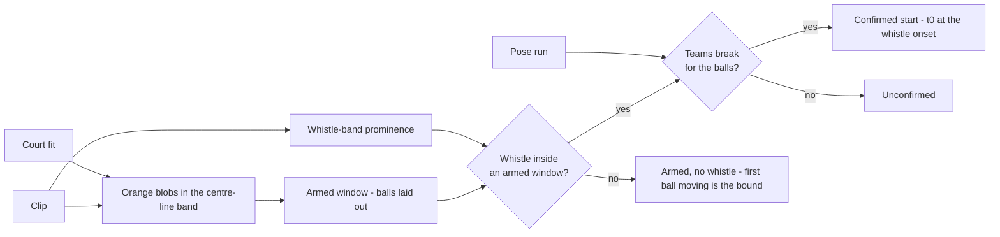

# Set-Start Detection

The throw metric is computed per set over live play, so every set needs a start
frame. This layer finds them from the footage instead of asking an annotator to
place one by hand, and it is the first stage in the pipeline to combine vision
with audio.

| File | Role |
|---|---|
| `src/setstart.py` | The three signals, and the reader for what they produce |
| `scripts/detect_set_start.py` | Runs them over a clip, writes `data/sets/<stem>.json` |
| `scripts/test_setstart.py` | Checks over both, including end to end on the clip |
| `tools/labeler` | Draws the result on the timeline's `MODEL` track and takes a verdict on it |

## The signature of a set start

A set opens identically every time: six balls laid on the centre line, both teams
waiting behind their baselines, a referee's whistle, twelve players sprinting for
the balls. Each of those is ambiguous alone. Together they are not.

### Balls on the line is a layout, not a count

Balls lie all over the floor during play, so counting orange is useless. What is
unique to a set setup is the *arrangement*: several balls within a few
centimetres of the centre line and spread across its width. The detector projects
a court-metre band about the centre line into the image through the homography,
finds orange blobs inside it, and keeps only those whose floor contact lands
within `BALL_LINE_TOLERANCE_M` of the line at a plausible size.

Size is where the geometry earns its place. The camera is end-on, so a ball at
the far end of the line is barely half the width of one at the near end. Blob
diameter is divided by the perspective scale at its contact row
(`Court.normalise`), which puts laid-out balls at ~0.027 at both ends of the line
against ~0.010 for the orange shoes and kit flashes that also fall inside the
band. No pixel threshold separates those at both ends of the court at once.

The count is deliberately not the discriminating test. A ball is routinely hidden
behind a player waiting at the baseline, so the gate is four balls, not six, and
the *spread* across the line carries the decision. On the evaluation clip this
yields exactly two windows in 210 s — the set the clip was cut around, and the
next set's setup at the end.

### The whistle is the start time, and only usable gated

Referees whistle for eliminations, line violations and timeouts throughout a set.
The evaluation clip contains sixteen whistle events of at least
`WHISTLE_MIN_PROMINENCE_DB` above the crowd; only one of them starts a set. Audio
alone cannot pick it out — the loudest whistle in the clip's first 35 s that is
*not* the rush is an elimination call.

Heard only while the balls are laid out, a whistle can mean almost nothing else,
which is why the gate does the disambiguating and the audio threshold can be
loose. Prominence is measured as the peak in `WHISTLE_BAND_HZ` over the mean of
`WHISTLE_REFERENCE_BAND_HZ`, so a whistle is judged against whatever noise the
room is making at that moment rather than an absolute level that a louder crowd
would defeat. The rush whistle measures 37 dB; the loudest non-start whistle in
the clip, 31 dB. Ungated, that margin is not enough to build on. Gated, nothing
else competes.

The **onset** of the strongest qualifying run is reported, not its peak: play
starts when the referee blows the whistle, not when the tone tops out.

### The sprint confirms, it does not time

Both teams wait behind their baselines, leaving the middle of the court empty.
Breaking for the balls fills it. The confirmation is `SPRINT_MIN_PLAYERS` player
detections with their feet inside `MID_COURT_M` within `SPRINT_WINDOW_S` of the
whistle — on the clip, zero mid-court players at the whistle and four 0.92 s
later.

This is what a false start, a warning whistle or a re-lay of the balls fails. It
is *not* used as the start time: it lags the whistle by the players' reaction and
their first strides, and that lag varies per set.

The test counts player detections through the court filter rather than people.
Referees, ball-kids and photographers stand around and on the court between sets,
and during the second armed window two of them stand at the centre line laying
balls out. Mid-court is defined to exclude the baseline strips both teams occupy
while waiting, so waiting is zero and playing is not.

## Failure and how it reports

The three outcomes are distinguished rather than collapsed, because they need
different handling downstream:

| Status | Meaning |
|---|---|
| `confirmed` | Layout, whistle inside it, break after it. `start_frame` is the whistle onset |
| `no_whistle` | Balls laid out but no whistle before the layout broke or the clip ended |
| `unconfirmed` | A whistle inside the layout that nothing followed |

For the two non-confirmed cases the frame where the layout first breaks is
reported instead. That is the fallback start when audio is missing or too muddy
to gate, and it is a **bound rather than an equivalent** — it is later than the
whistle by the reaction plus the run to the line, about 2.4 s on the clip.

The evaluation clip exercises this: it ends 13 s into the next set's setup,
before that set's whistle. The detector reports the second window as
`no_whistle` rather than promoting a crowd peak into a start it cannot support.

## The on-disk contract

Detection runs once per clip and the result is read back by every stage that
needs to know whether a frame is in play. The split mirrors the court fit and the
pose run: the script writes, `src/setstart.py` reads, and no stage re-derives
what another already computed.

`data/sets/<stem>.json` records the clip hash and the pose run it was built from,
and `SetTimeline.check_clip` refuses a timeline made on a different cut. Frame
indices are the only thing tying calibration, detections, labels and this
timeline together, and a re-encode shifts them without changing a filename. It
also records the thresholds the run used, so a timeline can be read back with the
values that produced it rather than whatever the constants say later.

The writer reads its own output back through the reader before reporting success,
so a timeline that cannot be consumed fails at the stage that wrote it.

### Live-play intervals

`SetTimeline.live_play_intervals()` turns starts into the intervals the throw
metric is computed over, and `interval_for(frame)` answers whether a throw counts.

Each interval begins at a confirmed start and ends where the balls are laid out
for the next set - or at the clip end if there is no next layout. That end is an
**upper bound**, not the moment play stopped: a set ends on its last elimination,
which needs the outcome resolver this layer sits upstream of. Every interval
carries `end_is_bound=True` to say so, rather than presenting a bound as a
measurement. On the evaluation clip the interval runs 17.32 s -> 196.80 s, which
overshoots the real end by the huddle between sets.

### In the labelling tool

The timeline's `MODEL` track draws each detected start as a pennant at its whistle frame, with
the detected live-play band shaded behind it, so the annotator checks a proposed frame instead
of hunting for the rush. A layout with no start still gets a mark - a hollow pennant on a dashed
stem - because dropping it would imply the detector found nothing there when what it found was
balls laid out and no whistle to go with them.

`data/sets/` itself is served read-only - a track the annotator could edit is not a track worth
comparing labels against. What the annotator does instead is **judge** it: each detected start
is a row in the event stream beside the frame, with its evidence (whistle prominence, break
frame, ball layout) in the row, and `Shift+A` / `Shift+R` act on the selected row or, with
nothing selected, on the detected window the playhead is inside. Pressing a verdict that is
already given takes it back.

#### A verdict is a record, not a filter

Accepting and rejecting both write a `SetReview` into the label file. Leaving a rejection as an
absence would make it identical to a detection nobody has looked at yet, and those are different
claims about the clip: the first is a false positive, the second is unreviewed work. Only one of
them belongs in a precision denominator, and nothing downstream could tell them apart afterwards.

A review names the **armed window** it judged rather than an index into the detector's output.
Re-running detection with different thresholds moves the windows, and a verdict recorded
positionally would silently reattach itself to a different set. A verdict matching no current
window is reported as stale, which is the annotator's work to redo.

#### Ground truth is not the accepted subset

If accepting a detection were the only way to create a set start, recall would be 1.0 by
construction - the truth set could not contain a start the detector never proposed. Starts are
still marked by hand with `L`, and a hand-marked start with no pennant beneath it on the `MODEL`
track is exactly a miss.

The reverse case is a window the detector armed but never timed. Its reported frame is where the
ball layout broke, which is later than the start by the reaction plus the run to the line, so it
**cannot be accepted at all**: accepting it would write that lag into ground truth. It is
rejected, or the start is placed by hand.

#### Where the accepted frame lives

An acceptance opens a live-play interval at the whistle frame, and the frame lives on that
interval and nowhere else - the review points at the interval by id rather than copying it, so
the two cannot drift apart. The interval's end is left open. The detector bounds a set by the
next ball layout, and as the previous section says that is a bound rather than a measurement:
accepting a start is not accepting it.

When an interval already covers the detected frame, accepting **agrees with it** rather than
adding a second start for one set. That is what makes a blind first pass followed by a
reconciliation pass work: the annotator's own frame stays theirs, and the detector's claim is
recorded alongside it.

#### Accepted truth is anchored truth, and says so

One keypress turning frame 433 into ground truth makes that truth depend on the model it will be
used to score. The workflow is worth the risk and the anchoring is real, so it is recorded rather
than assumed away: every interval carries `start_source` (`manual` or `model`) and, once a
detection is attached, `detected_start_frame` - kept unchanged when the annotator moves the
start. The distance between the two is the correction that was made, per accepted start, and it
is what turns a claim about annotator bias into something checkable. It is the same reasoning
that keeps a pose run's provenance on a snapped player box.

| Field | On | Meaning |
|---|---|---|
| `start_source` | `live_play[]` | Whether the start was placed blind or accepted from a detection |
| `detected_start_frame` | `live_play[]` | The frame the detector proposed, kept after any correction |
| `armed_start_frame`, `armed_end_frame` | `set_reviews[]` | The window the verdict judged |
| `detected_frame` | `set_reviews[]` | What was claimed, kept so a stale verdict is readable |
| `verdict` | `set_reviews[]` | `accepted` or `rejected`; absent means unreviewed |
| `interval_id` | `set_reviews[]` | The live-play interval an accepted start belongs to |

#### The live-play badge over the frame

Detection also gives the live-play badge over the frame something to say. It previously read
`outside live play` whenever the frame fell outside a hand-marked interval, which with nothing
marked meant always - and it read as a claim about the footage while actually being one about
the label file. Those are now separate statements: inside a detected set the badge names it and
says it is unmarked, outside every detected set it says no set is in progress, and with no
detection at all it says only that live play has not been marked. The tool never asserts the
match is dead without evidence that it is.

## Boundaries

Set **end** is not detected. It is the last elimination of a set, which needs the
throw-outcome resolver that this layer sits upstream of, so it is deferred until
the outcome stage exists. Until then a live-play interval runs from a detected
start to the next one.

The layout test assumes balls are laid out on the centre line, which is the WDBF
opening. A format that starts balls elsewhere needs a different band, though
nothing else about the structure changes.

## Failure modes worth knowing

The search band is grown towards the top of the image, because a ball is a solid
object whose pixels sit above where it touches the floor. Growing it the other way
leaves the ball bodies outside the mask and the detector finds nothing at all,
while the band still looks plausible if drawn - `test_reaches_above_the_floor`
fails if it is ever flipped back.

A clip cut without an audio track cannot be gated. That is raised as an error
naming the clip rather than returning every set unconfirmed, which would look
like a footage problem instead of a missing dependency. `ffmpeg` absent from PATH
is reported the same way.

## Configuration

Every threshold is a named constant at the top of `src/setstart.py`, in court
metres, decibels or seconds — none in pixels. The values there were set against
the evaluation clip; `data/sets/<stem>.json` records the ones a run used, so a
timeline can be read back with the thresholds that produced it.
