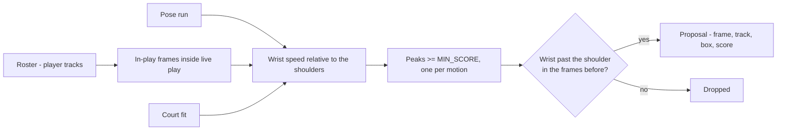

# Throw Candidates

Proposed throwing motions, found from the pose run and shown to the annotator
to accept, reject or adjust. The bootstrap for the truth set: labelling from
nothing means scrubbing three minutes of footage for every wind-up, and most of
that time goes on finding the moment rather than describing it.

| File | Role |
|---|---|
| `src/candidates.py` | The signal, the peak picking, and the `CandidateSet` reader |
| `scripts/detect_candidates.py` | Runs it over a clip, writes `data/candidates/<stem>.json` |
| `scripts/test_candidates.py` | Checks on the rules and on the evaluation clip |
| `tools/labeler` | Draws proposals on the timeline's `MODEL` track and takes a verdict |

Upstream: [[pose-precompute]] for the keypoints, [[court-geometry]] for the
perspective scale, [[set-start]] for when a set is live, [[roster]] for who is
a player and when they are in play.

## What a proposal claims

A frame and a thrower. Nothing else: not that the ball was released, not where
it went, not what happened to it. Those are the annotator's, and they are the
quick part — a keypress each once the moment is on screen. The proposal removes
the scrub.

That restraint is deliberate. The candidate stage of the pipeline will grow
out of this signal, and truth seeded by the model it will be scored against
flatters that model. The defences are the same ones [[set-start]] records for
accepted starts: every accepted proposal keeps `source: model` and the frame
that was proposed, so the correction the annotator made is measurable; a throw
the detector never proposed is still labelled by hand, or recall would be 1.0
by construction; and the blind second pass runs with proposals hidden, which
measures the missed-candidate rate directly rather than assuming it away.

## The signal

The fastest thing a wrist does in this footage is throw. Two corrections make
that usable:

**The body is subtracted.** Raw wrist speed fires on the opening sprint, on
dives and on pickups, because the whole body moves the wrist. Measured against
the shoulders' own motion, those go quiet and throws do not: raw speed gave
55 proposals a minute with about one in eight a throw in the middle band;
relative speed gave 31 a minute with about half.

**The wrist has been up.** A throw is wound up first, with the wrist past the
shoulder line within `WINDUP_LOOKBACK_S` of the peak. Of eight fast peaks
without a wind-up sampled on the clip, none was a throw (a sprint, standing up
from a dive, walking with a ball, a referee, the huddle). "Up" is along the
torso — hips to shoulders — rather than up the image, so that a player lying
on the floor does not have every wrist above the shoulder. The peak frame
itself counts as part of the window, because a sidearm throw reaches the
shoulder line only at the whip (frame 1509 on the clip) and losing it costs
recall where a spurious flick costs a keypress.

Speed is divided by the court fit's perspective scale at the feet, so one
threshold serves a near player at 280 px and a far one at 150 px. Peaks on one
track closer than `MIN_SEPARATION_S` are one motion.

## Who can be proposed

Only tracks the [[roster]] calls players, only on frames the roster says they
were in play, only inside a live-play interval from [[set-start]]. A referee's
arm at frame 4881 was proposed before the roster existed; it cannot be now.
Nothing before the whistle is scanned — the opening sprint is inside the
window, and the body subtraction is what keeps it quiet.

## How loose is loose

`MIN_SCORE` is set at 30, which on the evaluation clip gives 105 proposals over
three minutes of live play against the 80–100 events the plan expects — about
one proposal per real event, half of them rejections at a keypress each. Every
throw found by eye on the contact sheets (16, near and far, overhand and
sidearm) is proposed within a frame or two of its release. That is the setting
the plan asked for: rejections are cheap, and a missed candidate is the one
error that corrupts recall.

Two false-positive families survive and were left in on purpose. Players lying
on the floor with arms stretched past the head are wound up along their own
torso (577, 2004, 4048); an upright-torso gate did not remove them, because the
prone keypoints do not give a clean axis either. Keypoint jitter on a standing
player reads as a one-frame whip (1062, 1726, both USA #2 — the chest print
may be what unsettles the pose). Requiring the speed to hold over two frame
pairs removed the jitter and lost six of sixteen known throws: a release is a
one-frame spike at 25 fps. Neither family is worth a throw.

## The file

`data/candidates/<stem>.json` records the clip hash and pose run, the
thresholds used, and one record per proposal:

| Field | Meaning |
|---|---|
| `frame` | The peak of relative wrist speed — within a few frames of release on every true case checked |
| `track_id`, `participant` | The thrower, by the roster's ids |
| `team` | `near` or `far`, from the roster |
| `score` | Relative wrist speed at the peak, ×1000 |
| `detection_index` | Index into the pose run's detections on that frame |
| `box` | The thrower's box on that frame, copied so the tool can draw without the pose chunk |

`CandidateSet.check_clip` refuses a set detected on a different cut.

## In the labelling tool

Every proposal is a ring on the timeline's `MODEL` track at its frame — the
outcome scale's "no fill, no ball crossed", in the model's colour, because a
proposal claims a motion and nothing about a ball. Near the playhead, each
proposal's box is drawn on the frame in the same colour, labelled `proposed`,
never editable: the event it becomes is the thing to edit.

Proposals are rows in the one event stream beside the frame, alongside labels
and set starts ([[design-system#Event stream]]), each naming the thrower as
`key #number Name` from the [[roster]] and its names file, with the wrist
score as evidence. The work is a loop: filter to `unreviewed`, `>` selects the
next row and seeks to it, look, `⇧A` / `⇧R`. The verdict keys act on the
selected row, or with nothing selected on the row nearest the playhead when it
is within `MATCH_TOLERANCE_FRAMES`; set starts take the same keys.

**Accept** opens a release at the proposed frame with the proposed thrower
snapped, the side from the roster, and `source: 'model'` plus
`proposed_frame` written on the event. Usually it is not pressed at all:
choosing what the proposal *was* — an outcome, `P` for a pass, `F` for a
wind-up that released nothing (fakes are proposals too, and the truth set
labels them) — accepts it and labels it in one move, from the keyboard or the
card. From there it is an ordinary event: nudge the release, adjust the box,
place the target. If the annotator already
has a throw there — same moment within the tolerance, same player by box
overlap — accepting agrees with it and records the proposed frame beside their
own, so a blind pass followed by a reconciliation pass produces one throw, not
two. Accepting again is a no-op: the event is the thing to edit now.

**Reject** records a `candidate_reviews` entry with no event, for the reason a
set review does: "not accepted" and "not looked at" are the same silence in a
file and different claims about the clip, and only one belongs in a precision
denominator. Rejecting an accepted proposal takes its event back only while
the event is still bare — exactly what accepting created — and refuses once
the annotator has added anything, since those labels are not the detector's
to lose. Rejecting again clears the verdict.

A review names the proposal it judged by frame and box, not by position in
the detector's output, so a re-run that proposes differently leaves verdicts
stale and reported rather than silently reattached. The box and not the track
id: a track id belongs to the tracker and is renumbered by every re-run of the
identity pass, where the player was where they were. A review matches a
proposal on the same frame whose box overlaps its own by `MATCH_MIN_IOU`, the
same test that matches a proposal to a labelled thrower. Nothing a person
writes in the tool is keyed by an id the pipeline can regenerate. It also carries a `note`,
written for whoever reads the file next — why a rejection, or the nuance a
verdict cannot hold — and the note outlives a verdict that is taken back.

On the frame, the proposal being looked at is drawn loud and follows its
player from frame to frame through the roster's track; others in the same
second are drawn quiet with only their frame.

| Field | On | Meaning |
|---|---|---|
| `source` | `events[]` | `manual` or `model` — whether the event was placed blind or accepted from a proposal |
| `proposed_frame` | `events[]` | The frame the detector proposed, kept after any correction; null if never proposed |
| `frame`, `box` | `candidate_reviews[]` | The proposal the verdict judged: its frame and the thrower's box on it |
| `verdict` | `candidate_reviews[]` | `accepted` or `rejected`; absent means unreviewed |
| `event_id` | `candidate_reviews[]` | The event an acceptance created or agreed with |
| `note` | `candidate_reviews[]` | The annotator's reason or nuance, with or without a verdict |

Ground truth is not the accepted subset: a throw the detector missed is still
labelled with `T`, and an event on `YOU` with no ring beneath it is exactly a
miss. The blind second pass runs with proposals hidden.

## Boundaries

- The live-play interval's end is a bound, so the last ~15 s of proposals fall
  in the post-set huddle. That is set end's problem, not this layer's.
- The score is not a confidence. It ranks proposals for review order and
  nothing else; there is no calibration behind it.
- This is a bootstrap for labelling. The pipeline's candidate stage starts
  from the same signal — the [[release-gate]] takes these proposals as its
  input — and that dependence is recorded on every accepted event rather
  than hidden.
