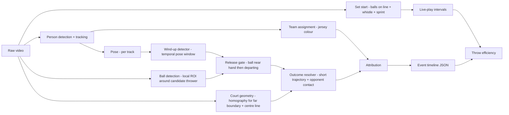

# Dodgeball Throw-Attempt Detection — Plan

Working plan for the trial project. This doc holds intent and open questions; once the
prototype ships, the design rationale graduates to `docs/architecture/` and this file is deleted.

## Context

The brief: pick one sport and one hard, fine-grained event that requires temporal reasoning,
turn real footage into an attributed event timeline plus one derived metric, and evaluate it
honestly. Budget is 8–12 hours total — roughly 2–3 on design, 6–9 on build and evaluation.

Scoring weights problem choice, evaluation rigour and honest uncertainty above raw accuracy.
The plan below is shaped by that: a precise event definition and a defensible truth set matter
more than the F1 number.

## Sport and event selection

Candidates considered, scored against the brief's criteria (specific, difficult, meaningful,
temporal) and against what is feasible in the budget:

| Sport / event | Temporal? | Attribution | Feasibility in budget | Verdict |
|---|---|---|---|---|
| Dodgeball — player elimination / re-entry | weak: a rule consequence, crisp boundaries | trivial (leaving player's team) | high | rejected — reads as "person crosses a line" |
| Dodgeball — throw attempt (wind-up → release → outcome) | strong: event only completes at outcome; fakes are wind-ups without release | thrower via pose + track; target via trajectory | medium — ball only needs local detection near the thrower | **chosen** |
| BJJ — positional change (guard pass, sweep) | strong | both athletes | low — entangled-body pose is unsolved at this budget; labelling needs expertise | rejected |
| Ice hockey — zone entry | strong | carrier (puck possession) | medium | rejected — listed as an example in the brief; puck attribution is the hard part and would dominate |
| Ultimate — turnover | strong | both teams | medium-high | fallback |

Dodgeball throws fit the pattern of the brief's own examples (volleyball attacks, tennis serve
phases): a multi-stage actor-attributed action whose outcome resolves over time.

### The event as a cascade

Every labelled thing starts as a *candidate* — a throwing motion — and resolves down a tree:

```
candidate (throwing motion)
├── fake      — wind-up, no release. Terminal: no ball outcome.
├── pass      — release, ball stays on the thrower's own side. Terminal: no state change.
└── throw     — release, ball crosses to the opposing side
    ├── hit
    ├── catch
    ├── block
    └── miss   (dodged or unobstructed)
```

Each level is a separate, measurable decision with its own failure mode, so ground truth is
labelled at every level and evaluation reports each level rather than one blended F1:

| Level | Decision | Where it fails |
|---|---|---|
| Candidate | is there a throwing motion at all? | recall ceiling — whatever is missed here is gone |
| Release | did the ball leave the hand? | occlusion at the release moment: genuinely unobservable, not merely hard |
| Destination | own side (pass) or opposing side (throw)? | shallow releases near the centre line; lobbed passes |
| Outcome | what happened to the ball? | graze vs dodge, catch vs drop — where label disagreement concentrates |

A throw is not complete at release: it stays open until something happens to the ball, and that
result must be attributed back to the right throw. With two balls in the air at once, that
attribution is the actual problem.

### Game state falls out of the timeline

In dodgeball the only thing that changes game state is a throw resolving. Folding the timeline
forward gives, at every frame, the active player count per side and therefore man-advantage:
a hit decrements the target's side; a catch decrements the thrower's side and increments the
catcher's; miss and block change nothing. This gives two consistency checks for free:

- **On labels** — reconstructed state must stay legal (0–6 players a side, an eliminated player
  cannot throw, a catch cannot return a player to a full side). A violation locates a bad label
  without needing a second annotator.
- **On predictions** — the same fold on the predicted timeline flags impossible sequences as
  false positives. A temporal prior at no cost.

The gap: eliminations that are not throw outcomes (line violations, ball-hold rules). Those are
why `outcome_visible` and the live-play intervals exist — state says what should have happened,
the flags say when the footage cannot confirm it.

### Set start — shipped

Detected rather than labelled: balls laid out on the centre line arm a window, a
whistle inside that window is the start, and the teams breaking for the balls
confirms it. Shipped and graduated to [[set-start]]; on the evaluation clip the
set starts at frame 433 (17.32 s, 6:17.3 of the half) and the clip's second ball
layout is correctly reported as having no whistle before the clip ends.

Set **end** shipped and graduated to [[set-end]]: the floor reads it (one side
down to one, then the court fills) at frame 4660 on the clip, the truth's own
end, and the hit is traced back to the last throw at that side in the window.

### Why this is hard

- **Fakes.** Pump fakes are a core tactic — a full wind-up with no release. A single-frame pose
  classifier fires on every one. Only a release check (ball leaves the hand region) separates
  a throw from a fake.
- **Passes.** A pass to a teammate is not a near-miss for the detector, it is *identical* up to
  the last stage: same wind-up, same arm kinematics, same ball leaving the hand. Everything
  that separates it from a throw happens afterwards, in where the ball goes. It is therefore
  the most structured false positive the system faces, and unlike a fake it cannot be rejected
  at the release gate.
- **Simultaneous throws.** Coordinated "countdown" attacks have several players releasing
  within ~200 ms. Overlapping events with separate attribution.
- **Outcome ambiguity.** Graze vs dodge, catch vs drop, block-then-catch — the ground truth is
  genuinely uncertain and referees disagree on it live.
- **Scale and occlusion.** Far-court players are roughly half the size of near-court ones at
  this camera angle; throwers are often occluded by teammates at release.
- **Non-throw ball handling.** Two seconds of play showed a teammate hand-off, a pickup and a
  dive — all of which involve a ball near a hand and arm motion.
- **Many balls.** Six near-identical balls in play. Global ball identity is deliberately *not*
  attempted — see signal strategy.

## Event definition (fixed 2026-08-26, after the clip was labelled)

**Throw attempt.** A player propels a ball toward the opposing side with a throwing motion.

The rules recognise nothing before release: a throw "must leave a player's hand" and the ball
is live "once the player is no longer in contact with the ball" (WDBF 2024, 15.2). A fake is a
coaching term, not a rule term, so what counts as one is this project's to define. A
**candidate** is any throwing motion by a player in play, with or without a ball: a wind-up
made with an empty hand is still a move meant to draw the opponent, and it is the same
motion to the stage that looks for motions. See [[wdbf-rules]].

Every candidate resolves to exactly one `kind` — `fake`, `pass` or `throw` — so the three are
mutually exclusive by construction rather than by convention. `fake` and `pass` are terminal.
A release whose destination was never observed carries no `kind` at all: an absent claim rather
than a fourth class, so it can be reported separately instead of defaulting into either.

| Field | Rule |
|---|---|
| `kind` | `fake` (no release), `pass` (released, ball stays on the thrower's own side), `throw` (released, ball crosses to the opposing side) |
| `eliminated` | on a `hit`: `false` where the player struck was already out — only a live player can be put out (WDBF 19.1) — so the hit counts as a ball event and not as an elimination. One on the evaluation clip (2701), found by folding the labels against the on-court count |
| `ball_in_hand` | on a `fake`: whether there was a ball to release. A fake with no ball is an event at the candidate level and is reported apart, since a stage that looks for the ball has nothing to find. Two on the evaluation clip |
| `start` | First frame of the wind-up: throwing arm moves behind the shoulder line with a ball in hand |
| `release` | First frame the ball is no longer in contact with the hand |
| `end` | Outcome resolution: the first contact that settles the ball — an opponent, a catch, a block, the floor or the far boundary. A pass ends the same way on its own side: the receiver's catch, or the floor if it is not caught |
| `actor` | Thrower (track ID + team). Team is required; player ID reported when the track is stable |
| `outcome` | one of `hit`, `catch`, `block`, `miss` (dodged or unobstructed), `unresolved` (occluded / off-frame) |
| `target` | player the ball reached, for `hit` / `catch` / `block` — required, since a catch eliminates the *thrower* and returns a player to the catcher's side while a hit eliminates the *target*. A pass reuses the same field for the receiver, which is optional |
| `confidence` | model confidence in (a) that a throw occurred, (b) attribution, (c) outcome — reported separately |

Labels additionally record what could be seen, so label uncertainty is separable from model
error: `release_visible`, `outcome_visible`, `ref_signal` (seen / not seen / not visible —
the closest thing to external truth on ambiguous hits), plus `uncertain` and a note.

**Live-play intervals** are one per set (opening rush → set end). Throws outside them do not
count, and the metric is computed per set. The start is detected rather than labelled
([[set-start]]); the end is the last elimination — "a set is won when a team has eliminated
all players of the opposing team" (WDBF 2024, 10.2.1) — which the harness takes from the
last labelled hit and the pipeline will take from the outcome resolver.

**Classified by destination, not intent.** A live ball that reaches an opponent eliminates them
whatever the thrower meant by it, so an errant pass that crosses and connects *is* a throw with
a hit. This is fortunate rather than merely convenient: destination is observable and intent
never is, so the rule the annotator applies and the rule the model applies can be the same one.
Confirmed against the ruleset: "passing throws and plays are not deemed invalid throws, if the
ball does not cross into the opponent team's fair territory" (WDBF 2024, 16.2) — a pass is a
throw that did not cross, by destination.

**Not a candidate at all:** underarm rolls to retrieve balls; hand-offs where the ball is
passed without a throwing motion; anything after the play is dead (whistle).

**Ambiguous cases (labelled with an `uncertain` flag):**

- Release frame hidden by occlusion — annotate the last visible frame with ball in hand and
  flag.
- Graze where the ball deflects with no visible reaction — outcome `hit?` flagged uncertain;
  the referee's call, if audible/visible, breaks the tie.
- Simultaneous throws where balls cross — attribute each by the thrower, never by the ball.
- A release whose destination is never observed — `kind` unresolved, flagged. This is the pass
  equivalent of an unresolved outcome and must not be silently counted as either.

## Derived metric

**Team throw efficiency** = eliminations ÷ throw attempts, per team per game, with a secondary
split by solo vs coordinated throws (coordinated = ≥2 same-team releases within 300 ms).

Passes are excluded from the denominator, so pass-vs-throw precision propagates directly into
the headline number: every pass misread as a throw understates efficiency. That makes it an
error-budget line item rather than a detail — and one with no free check, because a pass causes
no elimination and so leaves no trace in the game-state fold that cross-checks hits and catches.
Direction is the only evidence there is.

Why it is useful: it is the dodgeball equivalent of shooting percentage, and the solo vs
coordinated split answers a live tactical question — does attacking together actually convert
more often, or just spend more balls.

Error propagation: metric error depends on throw recall (denominator) and outcome accuracy
(numerator). Both are reported; the numerator will be the weaker one.

## Pipeline sketch



## Signal strategy

Expanded, with the measured negatives that reshaped it, in [design.pdf](../design.pdf) §3.

| Signal | Gives | Fails when | Role |
|---|---|---|---|
| Pose sequence (wrist/elbow/shoulder over ~0.5 s) | wind-up onset, throwing arm | small far-court players, occlusion, side-on arm ambiguity | primary for `start` |
| Ball near hand → departing | release only — *not* throw-vs-pass | ball hidden by body, motion blur post-release | primary for `release`; gates fakes |
| Departure direction in court metres, relative to the centre line | pass vs throw | shallow release near the centre line, lobbed pass | the only separator of the two; available because the court fit gives metres |
| Short post-release trajectory | direction → target side, outcome | crosses other balls, leaves frame | outcome |
| Court homography | which side, far boundary, out-zone, metre-scale normalisation | pan/zoom, few visible lines | **shipped** — see [[court-geometry]] |
| Audio (ball impact, whistle) | outcome corroboration, dead-ball | crowd noise, commentary | optional fusion — good ablation |
| Balls on centre line ∧ whistle ∧ sprint | set start `t0` | ball occluded on the line, muddy audio (fallback: first ball leaves the line) | **shipped** — see [[set-start]] |
| Global multi-ball tracking | ball possession counts | six identical balls, constant handoffs | **rejected** — not needed for the event and would consume the budget |

## Data

### Footage

Two candidates were compared:

| | WDBF 2014 Men's Final, Canada v USA, 2nd half | Sky Zone Ultimate Dodgeball Championship 2014 |
|---|---|---|
| Camera | single fixed elevated end-on camera for the whole half | produced broadcast: cuts every few seconds between wide, close-up, sideline and commentators; replays |
| Frame rate / size | 25 fps, 1920×1080 | 30 fps, 1920×1080 |
| Game | WDBF foam, 6-a-side, court fully in frame | trampoline dodgeball, players airborne much of the time |
| Verdict | **primary** | candidate *stress condition* ("harder camera angle") if time allows — cuts, re-identification across shots and replay de-duplication would otherwise swallow the budget, and "3 min continuous" is murky when continuity is cut every few seconds |

WDBF source: World Dodgeball Federation channel, https://www.youtube.com/watch?v=Spu6OlAZHUo.
Obtained by `scripts/download_footage.sh`; never committed.

### Segment

Set starts (balls lined on the centre line, both teams at their baselines, then the sprint) occur
at roughly 6:18, 9:28 and 13:08 in the half; sets run 3–3.5 min. The evaluation clip is
**6:00 → 9:30** (`scripts/make_clip.sh`, re-encoded so frame indices are exact): one complete set
from opening rush to the huddle, ending on the next opening rush, so all twelve players start on
court and the throw rate is at its highest. It contains ~18 s of pre-set at the start (outside
live play) and a partial lens obstruction at ~8:00 — a real failure condition we did not have to
manufacture. The 9:28 → 13:08 set is the natural held-out second set.

### Feasibility check (10 s of the clip, YOLO11x-pose at 1920 px)

| Observation | Number | Consequence |
|---|---|---|
| People detected per frame | mean 38.5 (33–44) vs 12 on court | sideline queues, bench, refs, crowd — a static court polygon in image space filters them; fixed camera means no homography needed for this |
| Near-team box height | median 280 px | full skeletons with clean arm keypoints; wind-ups clearly resolvable |
| Far-team box height | median 150 px, p10 91 px | skeletons present, arm keypoints coarse; wind-up detection will be lower-confidence — report the asymmetry rather than hide it |
| Ball in hand, near court | ~40–50 px, orange on red/grey | unmistakable unless between two bodies |
| Ball in flight, far court | ~15–20 px, still an obvious orange blob | colour carries a lot; an HSV blob detector is a viable baseline against a learned ball detector — a clean ablation |

Conclusion: the release gate is feasible as *ball near the throwing wrist, then ball departing*,
with no global ball tracking. Far-court releases will sometimes be unobservable — a
label-uncertainty case, not a model failure.

### Labels

- **Built here, not sourced.** No public dodgeball event dataset exists, and the brief requires a
  truth set we built and understand. Estimated cost: 50–70 throws plus 10–20 fakes at ~45 s
  each ≈ 1 h with a purpose-built tool, plus passes at a rate the footage has not yet been
  measured for — the first thing labelling will reveal, and a budget risk until it is known.
- **Anchor on the release frame.** It is the crispest moment and the one the temporal
  tolerance is measured against.
- **Per event:** release / start / end frames; thrower as a click *at the release frame*;
  target as a click *at the end frame* for hit/catch/block; team inferred from the court half
  the thrower click lands in (fixed camera, sides do not change within the half) with override;
  outcome; `kind`; `release_visible`, `outcome_visible`, `ref_signal`; `uncertain`; note. Each
  click records the frame it was made on — thrower and target are on different frames.
- **Clicks, not track IDs.** Player positions are stored in source pixels so evaluation matches
  them to any detector's boxes without depending on the tool's tracks.
- **Not labelled:** non-throw negatives (hand-offs, pickups). Too expensive up front; instead
  every false positive gets a cause category during analysis. Eliminations are not labelled
  either — they follow from outcome + target.
- **Tool:** `tools/labeler/` — design in [[labeling-tool]]: two-moment event flow, player boxes
  stored by value with pose detections as placement aid, overlay synced to the presented frame.
- **Guide:** `docs/labeling-guide.md` — the exact rule a second person would be handed.
- **Double-label a subset** (≈20 events, second pass done blind) to measure agreement on
  release frame and `outcome` — this is the label-uncertainty term in the error budget.

## Evaluation plan

| Level | Metric | Tolerance |
|---|---|---|
| Event detection | precision / recall / F1 on throw attempts | release within ±0.25 s (≈±6–7 frames at 25–30 fps) |
| Boundaries | mean abs error on `start` and `end` for matched events | — |
| Attribution | team accuracy; player accuracy where track is stable | on matched events |
| Kind | pass vs throw accuracy on released candidates; fakes reported separately | on matched events |
| Outcome | accuracy + confusion matrix over 5 classes | on matched throws |
| Metric | abs error in throw efficiency vs ground truth, per team | — |
| Stress | F1 under 3 conditions: 480p downscale, heavy CRF compression, 50% frame drop (and/or blur) | same tolerance — `scripts/stress.py`, [[evaluation#Stress conditions]] |
| Ablation | pose-only wind-up detector vs pose + release gate (fake rejection) vs + destination test (pass rejection) | same tolerance — `scripts/ablate.py`, [[evaluation#Ablation]] |
| Error budget | efficiency error by source; model (paired bootstrap) against labels (uncertain flags) and sampling | `scripts/error_budget.py`, [[evaluation#Error budget]] |

## Time budget (target 10 h)

| Phase | Hours | Output |
|---|---|---|
| Footage sourcing + feasibility check (pose at broadcast scale) | 1.0 | chosen match, 30 s pose sanity clip |
| Design doc + diagram | 2.0 | `docs/design.tex` → `docs/design.pdf` |
| Labelling (≥3 min, double-label subset) | 1.5 | `data/labels/` + guide |
| Pipeline build | 3.0 | runnable `run.py` producing timeline + metric |
| Evaluation, stress, ablation, error analysis | 1.5 | `output/` reports, tables |
| Write-up, README, walkthrough video | 1.0 | submission |

## Open questions

- Is a wind-up distinguishable from a normal arm swing at far-court scale? (feasibility check
  answers this — if not, restrict to near-court throws and say so)
- Broadcast frame rate: 25 vs 30 vs 50 fps changes the release-detection window.
- Are referee calls audible/visible enough to anchor ambiguous outcomes?
- Does the chosen footage include enough fakes and countdown attacks to make the FP analysis
  meaningful, or do we need a second match?
- How often do teams actually pass? Unmeasured, and it sets both the labelling cost and how
  much the metric's denominator depends on getting pass rejection right.

## Work log

- 2026-08-25 — brief reviewed, candidates compared, throw attempt chosen, repo initialised.
- 2026-08-25 — cascade framing (candidate → fake | throw → outcome) and game-state fold agreed.
- 2026-08-25 — labelling tool built (`tools/labeler/`), first-pass schema; needs target click,
  per-click frames, observability fields, ref signal and live-play intervals.
- 2026-08-25 — labelling tool plan written ([[labeling-tool]]): boxes by value, two-moment flow.
- 2026-08-25 — WDBF 2014 final chosen over Sky Zone; 6:00–9:30 clip cut; feasibility check run
  (pose scale, crowd count, ball visibility) — gate passed with far-court caveat.
- 2026-08-25 — pass promoted from an exclusion to a class: candidate → fake | pass | throw.
  Classified by destination rather than intent, since a live ball counts whatever was meant by
  it and destination is the only observable of the two. Passes leave no trace in the game-state
  fold, so direction is their only check.
- 2026-08-25 — court calibrated from detected lines; shipped and graduated to
  [[court-geometry]]. Floor identified as a regulation volleyball court (18 × 9 m) by
  held-out markings landing within 91 mm. Court filter cuts detections 38 → 9.7 per frame.
  Homography replaces the planned hand-drawn polygon, supplies the metre-defined margin
  band, the horizon-based scale model, and camera-drift detection.
- 2026-08-25 — set start defined as armed state (balls on the centre line, court empty) ∧
  whistle ∧ sprint, `t0` at the whistle. Audio alone rejected: refs whistle for hits too, and
  the loudest whistle in the clip's first 35 s is a hit call, not the rush. Set end deferred.
- 2026-08-25 — detected set starts became reviewable in the tool and graduated to
  [[set-start#A verdict is a record, not a filter]]. Accepting one opens live play at the
  whistle frame; rejecting is recorded rather than left as an absence, because "not accepted"
  and "not looked at" are the same silence in a file and a different claim about the clip.
  Ground truth is not the accepted subset — a start the detector missed is still marked by
  hand, or recall would be 1.0 by construction — and every accepted start carries the frame
  the model proposed alongside the annotator's, so the anchoring that one-keypress acceptance
  introduces is measurable rather than assumed away.
- 2026-08-25 — boundary slack re-expressed as pixels and graduated to
  [[court-geometry#The slack is spent in pixels, not metres]]. A flat 0.10 m bought ten pixels
  of ankle tolerance at the near baseline and under two at the far one, so the far-side waiting
  line strobed in and out of play: 142 of 156 short excursions were at that one boundary. Same
  budget spent per row is tighter than the old rule near the camera and four times looser where
  the pixels are scarce. A symmetric in-play hold absorbs the rest, taking excursions that
  return from 107 to 13 over the clip.
- 2026-08-25 — player identity shipped and graduated to [[player-identity]]. Outside this
  plan's scope and budget: it was taken up because tracking is what the boundary hold needed,
  and it turned into a subsystem. ByteTrack over the precomputed pose run holds twelve tracks
  across more than half the evaluation window with no appearance model at all; jersey numbers
  are read only on each track's largest crops and confirmed by agreement, giving five correct
  numbers over 85 tracks. Nothing downstream consumes it yet — attribution is still to build,
  and the number's veto has no merge stage to veto.
- 2026-08-25 — set start shipped and graduated to [[set-start]]. Layout-not-count test on the
  centre-line band gives two windows in the clip; the whistle gated by them is the one start
  among sixteen whistle events; the break for the balls confirms it 0.92 s later. Clip start
  detected at frame 433 (17.32 s). Audio enters the pipeline here for the first time.
- 2026-08-26 — identity checked against the full clip and found wanting: 29 names, 11
  wrong (dropped digits, referees, scrum merges) and one live-play swap the vote could not
  see because it only read a track's tallest crops. Graduated to [[player-identity]]: readings
  carry frames, crops are read across a track's whole life, a switch of number cuts the track
  (54 at 2881, the frame the swap completed), officials fall out via in-play gating, and
  three tracker-side preventions were measured and rejected. 12 names, all right by eye.
- 2026-08-26 — fragments joined by number and graduated to
  [[player-identity#Fragments are joined by their number]]. Tracks that confirm to the same
  number in sequence are one player; the same number on two tracks at once is two people
  and the number is left unjoined. 12 named tracks become 7 players on the clip, every join
  right by the sheet. The `players` block is what attribution will name the thrower from.
- 2026-08-26 — bootstrap candidates measured on the pose run before any tool work: raw
  wrist speed fires on sprints, dives and pickups (55/min at a usable threshold, ~1 in 8 a
  throw); wrist speed relative to the torso, gated on the wrist having been above the
  shoulder, gives 31/min at threshold 30 with about half real and, of eight fast non-overhead
  peaks, no throws lost. One proposal per expected event is the loose setting. Blocked on a
  clean answer to "is this a player" — a referee's arm at frame 4881 was proposed.
- 2026-08-26 — the roster shipped and graduated to [[roster]]: every track and person with a
  role and a team, one reader, no stage re-deriving either. Role comes from the game's rule —
  in play inside the live core is a player, whatever the kit — because USA #2's black chest
  print reads as dark as a referee's shirt; kit decides only for tracks never in live play.
  Four referees and the court-side staff are officials, no official is in play in the core,
  and `on_court` gives the elimination curve (6 v 6 at the rush, 6 v 1 by frame 4500) with no
  ball tracked. Built as a bridge over the identity pass's output; folding the writer into
  `identify_players.py` is handed off.
- 2026-08-26 — the identity pass writes the roster; the players file and the bridge builder
  are gone. Joining is by side and number, not number alone, because a chest-colour
  measurement showed #13 and #2 are USA (graduated to
  [[player-identity#Fragments are joined by their number]] and [[roster#How it is built]]).
  Two vote fixes on the way: a doubled digit (`77` beside `7`) no longer counts as dissent, and
  a half cut off a switched track keeps the number the switch found - CHALMERS 7 now runs
  56 → 422 → 285 through the swap. 14 named tracks, 7 players; roles and sides identical to
  the bridge's. Still unnamed and open: DICARLO 10 before 3296 (track 82, a reader failure
  on a folded 0), KUTNER (track 268, `4` ×3 declined beside one `45`), USA 27 and 55 (tracks
  17, 73 — full-set, one or two readings each) and two more far-side full-set tracks
  (12→167, 21).
- 2026-08-26 — throw candidates shipped and graduated to [[throw-candidates]]. Wrist speed
  relative to the shoulders, scale-normalised, gated on a wind-up past the shoulder line along
  the torso; only roster players, in play, inside live play. 105 proposals on the clip for
  80–100 expected events; every throw found by eye (16, overhand and sidearm, both ends) is
  proposed within a frame or two. Two refinements measured and rejected: an upright-torso gate
  removed nothing, and two-frame smoothing lost six of sixteen throws. The tool draws them as
  rings on `MODEL`, `>` walks the unreviewed ones, `⇧A` / `⇧R` judge; an accepted proposal is
  an ordinary event carrying `source: model` and its `proposed_frame`, so the anchoring is
  measurable. Label schema 4.
- 2026-08-26 — the tool's three event areas became one stream, per the design system's own
  rule: labels and the model's claims are both events at frames, switched on as two sources
  rather than chosen as views, with both on being the comparison. Rows name the thrower and
  the target as `key #number Name` from the roster, with names hand-authored beside it
  (`data/roster/<stem>.names.json`) because the reader reads digits only. The list follows
  the playhead with emphasis scaled by closeness, so simultaneous throws light up together;
  selection stays explicit so scrubbing cannot move what the keys edit. `F` marks the
  selected event a fake. Graduated to [[design-system#Event stream]].
- 2026-08-26 — the stream became cards that are the editor: a selected proposal is classified
  straight from its card (choosing what it was accepts it), a selected event opens into the full
  form, choices wear their outcome colours and verdicts the good/bad tones, reviews carry a
  note, emphasis is a lift scaled by closeness, `↑` `↓` walk the cards, and the proposal being
  looked at is drawn loud and follows its player through the roster's track. Label schema 4
  gains `note` on candidate reviews. Graduated to [[design-system#Event stream]].
- 2026-08-26 — player keys go to players in play per the roster, not to whoever the geometry
  admits: labelling at 0:21 found `Q` on a queued player outside the far touchline and `4` on
  an official, with two far players and #7 past the ends of the key rows. With a roster file
  the tool's held-on-court test is replaced by `RosterIndex.isPlayerInPlay`; checked on the
  real data at frames 515–535, `1`–`6` and `Q`–`Y` cover exactly the twelve in play.
  Graduated to [[roster#Queries]] and [[labeling-tool#Resolved]].

- 2026-08-26 — first experiments on the truth set (32 proposals reviewed, 20 events: 10 fake,
  3 pass, 7 throw). Pose alone cannot tell a fake from a release: wrist extension, elbow
  angle, follow-through depth, speed decay and re-wind-up all sit at AUC 0.3–0.7 on 10 v 10,
  which is the physically expected answer — a fake is the same motion with the ball kept. The
  ball can: the set-start orange mask counted inside a disc round the wrist goes dark within
  a few frames of the peak for a throw and stays lit for a fake (6 of 7 throws, 7 of 10 fakes
  on a crude +8..+14 presence rule). The misses were all instructive rather than noise: one
  fake tucks the ball in front of a body turned to the camera (occlusion, not release); one
  "pass" lobs one ball while holding a second; and two release frames in the truth set are
  not releases — 500 is a pickup with the pass ~30 frames later, and 565 is the wind-up with
  the release at 596 (its own note says so). The stock COCO ball detector was tried first and
  rejected: conf 0.1–0.6 and it drops out on exactly the blurred frames that matter; the mask
  sees the same ball at 20 px. Two consequences for labelling before this becomes a stage:
  every accepted proposal's `release_frame` equals its `proposed_frame`, and the strips show
  the peak is the whip, not the release (556 releases at +3/+4) — so the release frame must be
  stepped to by hand, or recorded as unset until it is; and a second ball in hand is a state
  the schema does not carry. One side finding for the candidate stage: the wrist's height at
  the peak, along the torso, separates the 12 rejects from the 20 accepted at AUC 0.85 — every
  set-start sprint has the wrist a full torso below the shoulder — but 20 samples is too few to
  move a threshold on, so it waits for the rest of the clip.
- 2026-08-26 — following the ball from release works, on the same orange mask and nothing
  else: seed on the blob that leaves the wrist, link blob to blob with a search radius that
  grows with the ball's image speed (a ball coming toward the camera accelerates and grows
  every frame; a hard throw moves 40 px in its first frame). Four of ten labelled releases
  were followed for the full 24-frame window and each path reads as its label: 535 runs from
  the thrower to a far player and kinks straight up off him (the block); 1077 crosses the far
  half past a diving player and bounces off the back (the miss); 728 lobs laterally along the
  far side, bounces once, reaches the far-right player (the pass). The six failures are all
  linker engineering rather than absent signal: greedy nearest-neighbour takes a wrong blob
  for one frame and its velocity is corrupted (556, the ball is visible in every frame); the
  seed picks the second ball still in the thrower's hand rather than the one that departs
  (511); the 565 and 500 rows are the mislabelled release frames above. Two design points
  for the stage: court metres from the floor homography are meaningless for an airborne ball,
  but a path's kinks are contacts — a player, the floor, the wall — and those project; and a
  path run backwards to the wrist it left is attribution, and is easier than reading the
  release frame itself, which the annotator's notes already say is the hard frame to name.
  Tolerances on the release frame, and whether release is defined from the ball path rather
  than the hand, are open.
- 2026-08-26 — scope for the next stage: the model's question is release or no release.
  Everything that is not a fake is a throw for now, a pass being a throw to one's own team;
  direction, and so pass against throw, is layered on later once the ball path exists. The
  label keeps `pass` as a kind and the metric still excludes it - only what is scored changes.
  The truth set makes the same cut: 10 fakes against 10 releases, where pass against throw
  is 3 against 7.
- 2026-08-26 — the full clip labelled: 60 events (29 throws, 25 fakes, 6 passes), 105
  proposals judged, set end known from the last hit at 4651.
- 2026-08-26 — the evaluation harness shipped and graduated to [[evaluation]]. Each level
  of the cascade is scored on its own and only where the prediction claims it. Matching is
  same-frame, same-player, with the roster's track carrying the labelled box to the frames
  around the release: a throwing player's box changes shape too fast for one frame's box to
  stand for the next, and three of sixty events fell under the overlap floor before that.
  Set end falls out of the last hit. Baseline for the proposals as a timeline: P 56% R 98%
  F1 72%, one release proposed twelve frames late.
- 2026-08-26 — the release gate shipped and graduated to [[release-gate]]. Pose features for
  event-or-not sat at AUC 0.4–0.7 on 60 v 45 (the wrist-height finding fell from 0.85 on 20 to
  0.69 on 105); the ball separates both decisions. The set-start orange mask was found lighting
  the near team's red jerseys wholesale — two "no ball" fakes scored higher on ball-in-hand
  than most throws — and a hue floor of 9 (ball 6–14, jersey 4–10) cleared it. Gate one: the
  rush, then a ball in the hand before the peak; gate two: a chain of blobs seen leaving the
  hand, seeded up to eight frames before the peak because the peak is the whip and the ball
  is already gone by it. The disc counts only ball-sized components, so "ball in hand" is a
  claim about shape as well as hue - it was shape, not hue, that finally cleared skin residue
  at the wrist. Candidate P 74% R 95% F1 83% (the misses: one late peak, two empty-handed
  fakes by design); release 79% on matched (fakes 18/23, releases 27/34); every pass called a
  throw as scoped. Absence of the ball was rejected as the release test: occlusion and a second
  ball in the other hand both fake it.
- 2026-08-26 — the definition fixed against the WDBF 2024 rules ([[wdbf-rules]]): the rules
  define a throw from release and say nothing of fakes, so a candidate is any throwing motion,
  ball or not; `ball_in_hand` on a fake records which, and the two empty-handed fakes on the
  clip (1448, 3490) carry it. Pass-by-destination is 16.2; set end is 10.2.1. The tool has no key
  for the flag yet — it was set by hand and the tool carries fields it does not know.
- 2026-08-26 — error analysis on the release gate, then the chain made to follow one ball
  ([[release-gate]]). Preferring the farthest chain over the longest showed the fault: two
  thirds of fakes had *some* chain leaving the hand, through socks, floor balls and the other
  hand's ball. Three constraints fix it - no link onto a blob that was there the frame before
  (a ball in flight never is), a first step capped at a throw's fifth of the scale, and one
  bridgeable frame for the whip where the mask drops the streak. Release 79% → 84% (fakes
  22/23, releases 26/34); the residual is far balls the mask never sees at the hand, a
  fragmented ball, a hand-over, a wrong-track label and the end-of-set double throw. Still
  open from the analysis: held-ball non-throws at gate one (blocking, hunkering, pickups -
  ~10 false positives) and one motion proposed twice (5).
- 2026-08-26 — gate one asks for a wind-up *with the ball*: the hand holding it must reach
  the shoulder line before the peak, the plan's own definition applied to the ball rather than
  the bare wrist. Blocks, raised catches, hunkering and pickups hold a ball and never get it
  there. Candidate P 74% → 84% at R 93%, F1 88%; release 86%. The one event it costs is the
  wrong-track label. A "held a torso below the shoulder" rule was tried and cut nothing more.
- 2026-08-26 — same-track doublets looked at and left. Two of the eleven remaining false
  positives are a wind-up peak twelve to fifteen frames before the release peak of one throw
  (1479/1492, 4641/4656, the ball in hand throughout), and the tolerance splits them; but a
  pump fake followed by a throw (516/535, 3191/3209) looks the same in every measure tried -
  gap, ball in hand between, and whether the wrist re-winds past the shoulder between the
  peaks, which is jittery by a whole torso frame to frame at this resolution. A rule fitted to
  two pairs is not a rule. The chain's seed frame as the release frame was measured too and
  is no better than the peak against this truth set (MAE 2.2 v 1.3) - not decidable here,
  since 41 of 60 labelled releases sit on the proposed peak.
- 2026-08-26 — destination shipped and graduated to [[destination]]. The floor homography
  cannot place a ball in the air (near throwers "stand" at court y 11–15 m by their ball), but
  the ball's first direction in the image can: this camera looks along the court, so the
  opponent is straight up or down the frame and a pass goes across. Every labelled pass is
  at 81° or beyond, most throws under 70°, and perspective flattens a cross-court throw into
  the high seventies, so the bar sits at 80 and a throw is the default. Kind 82% on matched:
  fakes 22/23, passes 4/6, throws 20/27, six of those the release misses carried down.
- 2026-08-26 — destination gains its second witness ([[destination]]): the chain is followed to
  where it stops (traces to +36, chains to 30 links - every labelled outcome settles within 21
  frames), and a last point inside a player's box is a contact - a teammate is a pass, an
  opponent a throw, no projection needed. Fifteen of twenty-six chained releases end in a box,
  none on the wrong side, and direction agreed on all fifteen. Contact decides where it exists,
  direction otherwise, and the timeline says which and whether they agreed. Kind 82% → 84%,
  passes 5/6; the one left has no chain (a hand-over). The roster's exits were measured as
  the outcome signal the plan proposed and found to lag a hit by 20–100 frames with tracker
  flicker on top - fine for the count, not for saying which throw; the ball resolves within
  21 frames. Outcome, when it comes, will read the chain's end and use exits to corroborate.
- 2026-08-27 — outcome shipped and graduated to [[outcome]]. The ball cannot say: at 25 fps
  the contact frame is where the chain loses it, and letting it through the box only grabs the
  next orange. The whistle band is shoe squeak on fakes as often as a call; single tracks
  fragment. A side's in-play count, held fifty frames, is the witness: a drop is a hit by the
  last throw at that side, a drop with a return opposite is a catch of that side's last throw,
  everything else a miss with block folded in. Outcome 65% on 20 matched throws; predicted
  efficiency near 4/15 (truth 4/15), far 1/12 (truth 2/14). Folding the labels against the
  count found two label errors - 1485 was a block, and 2701 hit a player already out
  (`eliminated: false`, WDBF 19.1) - and confirmed the sequence 2681/2701/2725 as two outs and
  two returns. The plan's original occupancy-first design stands for outcome, for a reason it
  did not have: the contact is unobservable, not merely noisy.
- 2026-08-27 — evaluation extras shipped and graduated to [[evaluation]]: detection by
  kind (throw F1 75% after the roster regen — kind accuracy on matched events hid the
  throws claimed on nothing), the ablation (throw F1 43% pose-only → 69% with the release
  gate → 75% with the destination test; the gate costs 18 points of throw recall for 33
  of precision), and
  the error budget (near 33% v 27% truth is right for the wrong reasons — five spurious
  throws and three invented hits cancel; the clip's own sampling interval, 11–52% on
  fifteen throws, is wider than the model's error band). Stress conditions built as
  derived stems with pixel-reading stages rerun and court, set starts and labels carried
  over; runs in progress. `scripts/test_release.py` no longer pins the proposal count.
  README written as the submission's write-up.
- 2026-08-27 — stress run on three conditions (480p, CRF 40, half rate) and read: 480p
  breaks the ball at the wrists and fragments identity; CRF 40 breaks pose itself; half
  rate loses the wind-up detector. Every window rewritten as a duration and the wrist
  speed as per-second (`src/timing.py`; identical at 25 fps, pinned by test) — which did
  not recover the half-rate loss: the whip is under-sampled, and `MIN_SCORE` is a
  property of the rate. Both rows kept. Graduated to [[pipeline]] and [[evaluation]].
- 2026-08-27 — productionised: `scripts/run.py` front door, `config/venue.toml` for the
  ball, court and kit assumptions (ball and court wired; roster's kit vocabulary and
  players-a-side declared, not yet wired). Set-up split (`scripts/tactics.py`): solo v
  coordinated v fake-led efficiency per set and team; pilot on the labelled set is bins
  of two and four; the whole second half is running through the pipeline unlabelled to
  see whether the pattern holds over three sets. Graduated to [[pipeline]].
- 2026-08-27 — clean-up: one clip hash (`src/hashing`), one prediction loader, the stress
  runner drives `run.py`'s stages, no script defaults to the evaluation clip, the roster's
  kit vocabulary comes from the venue file, `pyproject.toml` + `Makefile`. Left until the
  identity work commits: a single import style across `src/` (the bare-import `setstart`
  is why every script carries a `sys.path` prologue) and the tracking layer's frame-count
  holds.
- 2026-08-27 — the whole second half through `run.py`: 8 set starts, 7 set ends by floor,
  773 proposals → 240 throws, 12 min after pose. The labelled set scored from the half
  matches the clip run (near 28% v 27% truth). Across the half USA 40% v Canada 18%, far
  ahead in every set. Coordination scored per attack (Gary: "a combined effort, the stat
  doesn't make sense otherwise"): coordinated attacks convert at the solo rate on the
  half (40% v 42% far, 18% v 21% near, on 5 and 11 attacks). Fake-led: no signal. Identity pass OOM'd at 27 GB and
  now keeps only the shortlist's crops (`CropKeeper`). Graduated to [[pipeline]].
