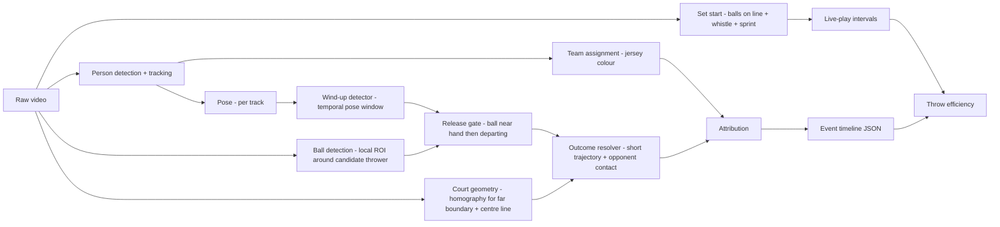

# Dodgeball Throw-Attempt Detection — Plan

Working plan for the trial project. This doc holds intent and open questions; once the
prototype ships, the design rationale graduates to `docs/architecture/` and this file is deleted.

## Context

The brief: pick one sport and one hard, fine-grained event that requires temporal reasoning,
turn real footage into an attributed event timeline plus one derived metric, and evaluate it
honestly. Budget is 8–12 hours total — roughly 2–3 on design, 6–9 on build and evaluation.

Scoring weights problem choice, evaluation rigour and honest uncertainty above raw accuracy.
The plan below is shaped by that: a precise event definition and a defensible truth set matter
more than the F1 number.

## Sport and event selection

Candidates considered, scored against the brief's criteria (specific, difficult, meaningful,
temporal) and against what is feasible in the budget:

| Sport / event | Temporal? | Attribution | Feasibility in budget | Verdict |
|---|---|---|---|---|
| Dodgeball — player elimination / re-entry | weak: a rule consequence, crisp boundaries | trivial (leaving player's team) | high | rejected — reads as "person crosses a line" |
| Dodgeball — throw attempt (wind-up → release → outcome) | strong: event only completes at outcome; fakes are wind-ups without release | thrower via pose + track; target via trajectory | medium — ball only needs local detection near the thrower | **chosen** |
| BJJ — positional change (guard pass, sweep) | strong | both athletes | low — entangled-body pose is unsolved at this budget; labelling needs expertise | rejected |
| Ice hockey — zone entry | strong | carrier (puck possession) | medium | rejected — listed as an example in the brief; puck attribution is the hard part and would dominate |
| Ultimate — turnover | strong | both teams | medium-high | fallback |

Dodgeball throws fit the pattern of the brief's own examples (volleyball attacks, tennis serve
phases): a multi-stage actor-attributed action whose outcome resolves over time.

### The event as a cascade

Every labelled thing starts as a *candidate* — a throwing motion — and resolves down a tree:

```
candidate (throwing motion)
├── fake      — wind-up, no release. Terminal: no ball outcome.
├── pass      — release, ball stays on the thrower's own side. Terminal: no state change.
└── throw     — release, ball crosses to the opposing side
    ├── hit
    ├── catch
    ├── block
    └── miss   (dodged or unobstructed)
```

Each level is a separate, measurable decision with its own failure mode, so ground truth is
labelled at every level and evaluation reports each level rather than one blended F1:

| Level | Decision | Where it fails |
|---|---|---|
| Candidate | is there a throwing motion at all? | recall ceiling — whatever is missed here is gone |
| Release | did the ball leave the hand? | occlusion at the release moment: genuinely unobservable, not merely hard |
| Destination | own side (pass) or opposing side (throw)? | shallow releases near the centre line; lobbed passes |
| Outcome | what happened to the ball? | graze vs dodge, catch vs drop — where label disagreement concentrates |

A throw is not complete at release: it stays open until something happens to the ball, and that
result must be attributed back to the right throw. With two balls in the air at once, that
attribution is the actual problem.

### Game state falls out of the timeline

In dodgeball the only thing that changes game state is a throw resolving. Folding the timeline
forward gives, at every frame, the active player count per side and therefore man-advantage:
a hit decrements the target's side; a catch decrements the thrower's side and increments the
catcher's; miss and block change nothing. This gives two consistency checks for free:

- **On labels** — reconstructed state must stay legal (0–6 players a side, an eliminated player
  cannot throw, a catch cannot return a player to a full side). A violation locates a bad label
  without needing a second annotator.
- **On predictions** — the same fold on the predicted timeline flags impossible sequences as
  false positives. A temporal prior at no cost.

The gap: eliminations that are not throw outcomes (line violations, ball-hold rules). Those are
why `outcome_visible` and the live-play intervals exist — state says what should have happened,
the flags say when the footage cannot confirm it.

### Set start — shipped

Detected rather than labelled: balls laid out on the centre line arm a window, a
whistle inside that window is the start, and the teams breaking for the balls
confirms it. Shipped and graduated to [[set-start]]; on the evaluation clip the
set starts at frame 433 (17.32 s, 6:17.3 of the half) and the clip's second ball
layout is correctly reported as having no whistle before the clip ends.

Set **end** (the last elimination) is deferred until the outcome resolver exists;
until then a live-play interval runs from one detected start to the next.

### Why this is hard

- **Fakes.** Pump fakes are a core tactic — a full wind-up with no release. A single-frame pose
  classifier fires on every one. Only a release check (ball leaves the hand region) separates
  a throw from a fake.
- **Passes.** A pass to a teammate is not a near-miss for the detector, it is *identical* up to
  the last stage: same wind-up, same arm kinematics, same ball leaving the hand. Everything
  that separates it from a throw happens afterwards, in where the ball goes. It is therefore
  the most structured false positive the system faces, and unlike a fake it cannot be rejected
  at the release gate.
- **Simultaneous throws.** Coordinated "countdown" attacks have several players releasing
  within ~200 ms. Overlapping events with separate attribution.
- **Outcome ambiguity.** Graze vs dodge, catch vs drop, block-then-catch — the ground truth is
  genuinely uncertain and referees disagree on it live.
- **Scale and occlusion.** Far-court players are roughly half the size of near-court ones at
  this camera angle; throwers are often occluded by teammates at release.
- **Non-throw ball handling.** Two seconds of play showed a teammate hand-off, a pickup and a
  dive — all of which involve a ball near a hand and arm motion.
- **Many balls.** Six near-identical balls in play. Global ball identity is deliberately *not*
  attempted — see signal strategy.

## Event definition (draft — to be frozen before labelling)

**Throw attempt.** A player propels a ball toward the opposing side with a throwing motion.

Every candidate resolves to exactly one `kind` — `fake`, `pass` or `throw` — so the three are
mutually exclusive by construction rather than by convention. `fake` and `pass` are terminal.
A release whose destination was never observed carries no `kind` at all: an absent claim rather
than a fourth class, so it can be reported separately instead of defaulting into either.

| Field | Rule |
|---|---|
| `kind` | `fake` (no release), `pass` (released, ball stays on the thrower's own side), `throw` (released, ball crosses to the opposing side) |
| `start` | First frame of the wind-up: throwing arm moves behind the shoulder line with a ball in hand |
| `release` | First frame the ball is no longer in contact with the hand |
| `end` | Outcome resolution: ball contacts an opponent, is caught, is blocked, or crosses the far boundary / hits the floor unimpeded |
| `actor` | Thrower (track ID + team). Team is required; player ID reported when the track is stable |
| `outcome` | one of `hit`, `catch`, `block`, `miss` (dodged or unobstructed), `unresolved` (occluded / off-frame) |
| `target` | player the ball reached, for `hit` / `catch` / `block` — required, since a catch eliminates the *thrower* and returns a player to the catcher's side while a hit eliminates the *target*. A pass reuses the same field for the receiver, which is optional |
| `confidence` | model confidence in (a) that a throw occurred, (b) attribution, (c) outcome — reported separately |

Labels additionally record what could be seen, so label uncertainty is separable from model
error: `release_visible`, `outcome_visible`, `ref_signal` (seen / not seen / not visible —
the closest thing to external truth on ambiguous hits), plus `uncertain` and a note.

**Live-play intervals** are one per set (opening rush → set end). Throws outside them do not
count, and the metric is computed per set. The start is detected rather than labelled
([[set-start]]); the end still is not, so an interval currently runs to the next start.

**Classified by destination, not intent.** A live ball that reaches an opponent eliminates them
whatever the thrower meant by it, so an errant pass that crosses and connects *is* a throw with
a hit. This is fortunate rather than merely convenient: destination is observable and intent
never is, so the rule the annotator applies and the rule the model applies can be the same one.
(To confirm against the WDBF ruleset before the definition is frozen.)

**Not a candidate at all:** underarm rolls to retrieve balls; hand-offs where the ball is
passed without a throwing motion; anything after the play is dead (whistle).

**Ambiguous cases (labelled with an `uncertain` flag):**

- Release frame hidden by occlusion — annotate the last visible frame with ball in hand and
  flag.
- Graze where the ball deflects with no visible reaction — outcome `hit?` flagged uncertain;
  the referee's call, if audible/visible, breaks the tie.
- Simultaneous throws where balls cross — attribute each by the thrower, never by the ball.
- A release whose destination is never observed — `kind` unresolved, flagged. This is the pass
  equivalent of an unresolved outcome and must not be silently counted as either.

## Derived metric

**Team throw efficiency** = eliminations ÷ throw attempts, per team per game, with a secondary
split by solo vs coordinated throws (coordinated = ≥2 same-team releases within 300 ms).

Passes are excluded from the denominator, so pass-vs-throw precision propagates directly into
the headline number: every pass misread as a throw understates efficiency. That makes it an
error-budget line item rather than a detail — and one with no free check, because a pass causes
no elimination and so leaves no trace in the game-state fold that cross-checks hits and catches.
Direction is the only evidence there is.

Why it is useful: it is the dodgeball equivalent of shooting percentage, and the solo vs
coordinated split answers a live tactical question — does attacking together actually convert
more often, or just spend more balls.

Error propagation: metric error depends on throw recall (denominator) and outcome accuracy
(numerator). Both are reported; the numerator will be the weaker one.

## Pipeline sketch



## Signal strategy (to expand in the design doc)

| Signal | Gives | Fails when | Role |
|---|---|---|---|
| Pose sequence (wrist/elbow/shoulder over ~0.5 s) | wind-up onset, throwing arm | small far-court players, occlusion, side-on arm ambiguity | primary for `start` |
| Ball near hand → departing | release only — *not* throw-vs-pass | ball hidden by body, motion blur post-release | primary for `release`; gates fakes |
| Departure direction in court metres, relative to the centre line | pass vs throw | shallow release near the centre line, lobbed pass | the only separator of the two; available because the court fit gives metres |
| Short post-release trajectory | direction → target side, outcome | crosses other balls, leaves frame | outcome |
| Court homography | which side, far boundary, out-zone, metre-scale normalisation | pan/zoom, few visible lines | **shipped** — see [[court-geometry]] |
| Audio (ball impact, whistle) | outcome corroboration, dead-ball | crowd noise, commentary | optional fusion — good ablation |
| Balls on centre line ∧ whistle ∧ sprint | set start `t0` | ball occluded on the line, muddy audio (fallback: first ball leaves the line) | **shipped** — see [[set-start]] |
| Global multi-ball tracking | ball possession counts | six identical balls, constant handoffs | **rejected** — not needed for the event and would consume the budget |

## Data

### Footage

Two candidates were compared:

| | WDBF 2014 Men's Final, Canada v USA, 2nd half | Sky Zone Ultimate Dodgeball Championship 2014 |
|---|---|---|
| Camera | single fixed elevated end-on camera for the whole half | produced broadcast: cuts every few seconds between wide, close-up, sideline and commentators; replays |
| Frame rate / size | 25 fps, 1920×1080 | 30 fps, 1920×1080 |
| Game | WDBF foam, 6-a-side, court fully in frame | trampoline dodgeball, players airborne much of the time |
| Verdict | **primary** | candidate *stress condition* ("harder camera angle") if time allows — cuts, re-identification across shots and replay de-duplication would otherwise swallow the budget, and "3 min continuous" is murky when continuity is cut every few seconds |

WDBF source: World Dodgeball Federation channel, https://www.youtube.com/watch?v=Spu6OlAZHUo.
Obtained by `scripts/download_footage.sh`; never committed.

### Segment

Set starts (balls lined on the centre line, both teams at their baselines, then the sprint) occur
at roughly 6:18, 9:28 and 13:08 in the half; sets run 3–3.5 min. The evaluation clip is
**6:00 → 9:30** (`scripts/make_clip.sh`, re-encoded so frame indices are exact): one complete set
from opening rush to the huddle, ending on the next opening rush, so all twelve players start on
court and the throw rate is at its highest. It contains ~18 s of pre-set at the start (outside
live play) and a partial lens obstruction at ~8:00 — a real failure condition we did not have to
manufacture. The 9:28 → 13:08 set is the natural held-out second set.

### Feasibility check (10 s of the clip, YOLO11x-pose at 1920 px)

| Observation | Number | Consequence |
|---|---|---|
| People detected per frame | mean 38.5 (33–44) vs 12 on court | sideline queues, bench, refs, crowd — a static court polygon in image space filters them; fixed camera means no homography needed for this |
| Near-team box height | median 280 px | full skeletons with clean arm keypoints; wind-ups clearly resolvable |
| Far-team box height | median 150 px, p10 91 px | skeletons present, arm keypoints coarse; wind-up detection will be lower-confidence — report the asymmetry rather than hide it |
| Ball in hand, near court | ~40–50 px, orange on red/grey | unmistakable unless between two bodies |
| Ball in flight, far court | ~15–20 px, still an obvious orange blob | colour carries a lot; an HSV blob detector is a viable baseline against a learned ball detector — a clean ablation |

Conclusion: the release gate is feasible as *ball near the throwing wrist, then ball departing*,
with no global ball tracking. Far-court releases will sometimes be unobservable — a
label-uncertainty case, not a model failure.

### Labels

- **Built here, not sourced.** No public dodgeball event dataset exists, and the brief requires a
  truth set we built and understand. Estimated cost: 50–70 throws plus 10–20 fakes at ~45 s
  each ≈ 1 h with a purpose-built tool, plus passes at a rate the footage has not yet been
  measured for — the first thing labelling will reveal, and a budget risk until it is known.
- **Anchor on the release frame.** It is the crispest moment and the one the temporal
  tolerance is measured against.
- **Per event:** release / start / end frames; thrower as a click *at the release frame*;
  target as a click *at the end frame* for hit/catch/block; team inferred from the court half
  the thrower click lands in (fixed camera, sides do not change within the half) with override;
  outcome; `kind`; `release_visible`, `outcome_visible`, `ref_signal`; `uncertain`; note. Each
  click records the frame it was made on — thrower and target are on different frames.
- **Clicks, not track IDs.** Player positions are stored in source pixels so evaluation matches
  them to any detector's boxes without depending on the tool's tracks.
- **Not labelled:** non-throw negatives (hand-offs, pickups). Too expensive up front; instead
  every false positive gets a cause category during analysis. Eliminations are not labelled
  either — they follow from outcome + target.
- **Tool:** `tools/labeler/` — design in [[labeling-tool]]: two-moment event flow, player boxes
  stored by value with pose detections as placement aid, overlay synced to the presented frame.
- **Guide:** `docs/labeling-guide.md` — the exact rule a second person would be handed.
- **Double-label a subset** (≈20 events, second pass done blind) to measure agreement on
  release frame and `outcome` — this is the label-uncertainty term in the error budget.

## Evaluation plan

| Level | Metric | Tolerance |
|---|---|---|
| Event detection | precision / recall / F1 on throw attempts | release within ±0.25 s (≈±6–7 frames at 25–30 fps) |
| Boundaries | mean abs error on `start` and `end` for matched events | — |
| Attribution | team accuracy; player accuracy where track is stable | on matched events |
| Kind | pass vs throw accuracy on released candidates; fakes reported separately | on matched events |
| Outcome | accuracy + confusion matrix over 5 classes | on matched throws |
| Metric | abs error in throw efficiency vs ground truth, per team | — |
| Stress | F1 under 3 conditions: 480p downscale, heavy CRF compression, 50% frame drop (and/or blur) | same tolerance |
| Ablation | pose-only wind-up detector vs pose + release gate (fake rejection) vs + destination test (pass rejection) | same tolerance |

## Time budget (target 10 h)

| Phase | Hours | Output |
|---|---|---|
| Footage sourcing + feasibility check (pose at broadcast scale) | 1.0 | chosen match, 30 s pose sanity clip |
| Design doc + diagram | 2.0 | `docs/design.md` |
| Labelling (≥3 min, double-label subset) | 1.5 | `data/labels/` + guide |
| Pipeline build | 3.0 | runnable `run.py` producing timeline + metric |
| Evaluation, stress, ablation, error analysis | 1.5 | `output/` reports, tables |
| Write-up, README, walkthrough video | 1.0 | submission |

## Open questions

- Is a wind-up distinguishable from a normal arm swing at far-court scale? (feasibility check
  answers this — if not, restrict to near-court throws and say so)
- Broadcast frame rate: 25 vs 30 vs 50 fps changes the release-detection window.
- Are referee calls audible/visible enough to anchor ambiguous outcomes?
- Does the chosen footage include enough fakes and countdown attacks to make the FP analysis
  meaningful, or do we need a second match?
- How often do teams actually pass? Unmeasured, and it sets both the labelling cost and how
  much the metric's denominator depends on getting pass rejection right.
- Does the WDBF ruleset treat a ball as live regardless of the thrower's intent, as assumed by
  classifying on destination?

## Work log

- 2026-08-25 — brief reviewed, candidates compared, throw attempt chosen, repo initialised.
- 2026-08-25 — cascade framing (candidate → fake | throw → outcome) and game-state fold agreed.
- 2026-08-25 — labelling tool built (`tools/labeler/`), first-pass schema; needs target click,
  per-click frames, observability fields, ref signal and live-play intervals.
- 2026-08-25 — labelling tool plan written ([[labeling-tool]]): boxes by value, two-moment flow.
- 2026-08-25 — WDBF 2014 final chosen over Sky Zone; 6:00–9:30 clip cut; feasibility check run
  (pose scale, crowd count, ball visibility) — gate passed with far-court caveat.
- 2026-08-25 — pass promoted from an exclusion to a class: candidate → fake | pass | throw.
  Classified by destination rather than intent, since a live ball counts whatever was meant by
  it and destination is the only observable of the two. Passes leave no trace in the game-state
  fold, so direction is their only check.
- 2026-08-25 — court calibrated from detected lines; shipped and graduated to
  [[court-geometry]]. Floor identified as a regulation volleyball court (18 × 9 m) by
  held-out markings landing within 91 mm. Court filter cuts detections 38 → 9.7 per frame.
  Homography replaces the planned hand-drawn polygon, supplies the metre-defined margin
  band, the horizon-based scale model, and camera-drift detection.
- 2026-08-25 — set start defined as armed state (balls on the centre line, court empty) ∧
  whistle ∧ sprint, `t0` at the whistle. Audio alone rejected: refs whistle for hits too, and
  the loudest whistle in the clip's first 35 s is a hit call, not the rush. Set end deferred.
- 2026-08-25 — set start shipped and graduated to [[set-start]]. Layout-not-count test on the
  centre-line band gives two windows in the clip; the whistle gated by them is the one start
  among sixteen whistle events; the break for the balls confirms it 0.92 s later. Clip start
  detected at frame 433 (17.32 s). Audio enters the pipeline here for the first time.
